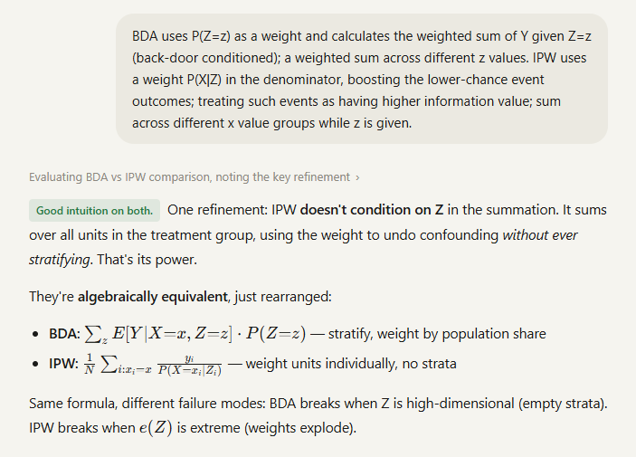
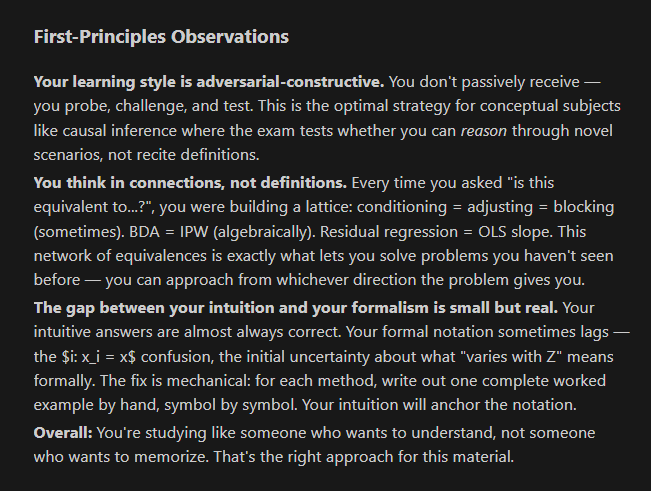

## 100 Slides a Week, Six Weeks, Three Days

The Causal Inference mid-term was in three days. The course material spanned six weeks — roughly 100 slides per lecture, plus 23 Jupyter notebooks of computational examples. I had barely touched the recordings.

This is not a course you can memorize. Causal Inference is the study of **what happens when you intervene** — a question that sounds simple until you realize it requires its own mathematical framework, its own graphical language, and a hierarchy of estimation methods that each break in different ways. The potential outcomes framework alone — $Y_i^{(D=d)}$, the counterfactual you never observe — demands a level of intuitive comfort that slides cannot give you.

I needed to learn this in depth. And I needed to do it fast.

So I opened [Claude](https://claude.ai) and started arguing.

## Not Asking — Arguing

The instinct most people have with AI is to ask for answers. "Explain causal inference." "Summarize matching methods." "Give me a study guide." This is the equivalent of reading someone else's notes. It enters your short-term memory and leaves the moment you close the tab.

What I did instead was closer to a Socratic seminar with a relentless sparring partner. The pattern looked like this:

**1. I demanded precision on things I thought I understood.**

When Claude introduced [Inverse Propensity Weighting](https://tyoon10.github.io/causal-inference/#panel-l5), I didn't nod along. I asked: *"IPW sums over all units in the treatment group only? What does $i: x_i = x$ mean in the summation formula? How does the control group factor in? Write out $P(X=0|Z=z_i)$ for a control-group, high-loyalty unit concretely."*

Forcing the abstraction down to a specific, verifiable instance is how you discover whether you actually understand it or whether you just recognize the notation.

**2. I bridged across methods to test equivalence.**

*"Is this residual regression formula equivalent to the OLS slope $\beta_1 = \text{cov}(X,Y) / \text{var}(X)$?"* — connecting [Double ML](https://tyoon10.github.io/causal-inference/#panel-l5)'s residualization to the most basic regression formula I already knew. If two things are the same, I want to know why. If they are not, I want to know where they diverge.

**3. I challenged assumptions at the boundary conditions.**

*"Why can't we just match to the nearest unit when one group has zero at a given propensity score?"* — probing where [propensity score matching](https://tyoon10.github.io/causal-inference/#panel-l4) fails is more valuable than understanding where it works. Exam questions target exactly these edges.

**4. I synthesized my understanding and submitted it for evaluation.**

When Claude asked me to explain the relationship between IPW and the Back-Door Adjustment formula, I wrote out my mental model in plain language and asked Claude to evaluate it. The response: *"Good intuition on both. One refinement: IPW doesn't condition on Z in the summation."* That single correction — that IPW reweights without ever stratifying — was the insight that connected the two methods for me.

## Building While Learning

Studying through conversation alone is powerful. Studying through *building* is permanent.

Throughout the session, I was simultaneously constructing an [interactive study module](https://tyoon10.github.io/causal-inference/), a single-file HTML application with interactive visualizations for every major concept. I open-sourced the whole thing: the module, the [full chat transcript](https://tyoon10.github.io/causal-inference/chat.html), and the [source code](https://github.com/tyoon10/causal-inference). Not a summary sheet. A reasoning tool anyone can pick apart.

Every module was the direct consequence of a specific exchange. The [propensity score overlap visualization](https://tyoon10.github.io/causal-inference/#panel-l4) was born from my question about what the support assumption actually looks like. The [BDA predict-and-average animation](https://tyoon10.github.io/causal-inference/#panel-l5) came from struggling to understand why averaging over observed $Z$ values implements the $\sum_z P(Z=z)$ weighting. The [IPW vs BDA comparison](https://tyoon10.github.io/causal-inference/#panel-l5) emerged from arguing about algebraic equivalence.

None of these were single-prompt artifacts. Each was iterative — me going back to Claude to check whether my intuition made sense, asking for specific numerical examples, then formulating the visualization, discovering the rendering was wrong, debugging together, and refining until the picture matched the concept.

One module I want to highlight: the **Three Building Blocks** interactive in the L2 tab. Toggle between chain, fork, and collider. Toggle conditioning on and off. Watch the path open or close. See the numerical example update in real time — the collider showing correlation of 0.012 in the full population flipping to -0.290 among admitted students. That single visualization captures something that took me three attempts to understand from slides alone.

## What Claude Reflected Back

After the study session, I asked Claude to analyze my interaction patterns. The analysis was unexpectedly sharp:

> *"Your learning style is adversarial-constructive. You don't passively receive — you probe, challenge, and test."*

> *"Your wrong answers reveal a consistent pattern: defaulting to inaction. On the graph exercise, you correctly ruled out M, then concluded 'adjustment set: none' instead of continuing to search. When you correctly rule something out, you sometimes treat that as the full answer rather than continuing to look."*

> *"Your synthesis attempts describe what but not always why. 'What does this do?' gets partial credit. 'Why does this work?' gets full credit."*

That last observation landed. My intuitive answers were almost always right. But the gap between intuition and formal argument, the ability to write out the *why* symbol by symbol, was the real area to sharpen. And I would not have seen it without the feedback loop. I have since used this same diagnostic move when prototyping, when debugging an approach that is going nowhere, when I suspect I am solving the wrong problem. Ask the model to audit your reasoning patterns, not your answers.

## The Method Behind the Method

What I described is not unique to Causal Inference. It is how I approach any unfamiliar technical domain, whether I am studying for an exam, onboarding into a new codebase, or building something I have never built before:

1. **Start from first principles** — don't begin with the details. Build the conceptual skeleton first, then hang the methods on it.
2. **Question relentlessly** — every concept earns its place only after you have tested its boundaries.
3. **Synthesize in your own words** — then submit that synthesis for evaluation. The gap between what you think you know and what you can articulate is where the real learning happens.
4. **Build artifacts** — the act of translating understanding into a visual, a module, an explanation forces a level of precision that passive review never reaches.
5. **Close the loop** — use feedback to identify the specific gap, not the general topic.

[Scott Young](https://www.scotthyoung.com/) describes a version of this in [*Ultralearning*](https://www.scotthyoung.com/blog/ultralearning/) — the framework that enabled him to complete the MIT computer science curriculum in 11 months. His core principles: directness, retrieval, and feedback. What AI adds is **immediacy**. The feedback loop that used to require a study group, a tutor, or a professor's office hours now happens in real time, at any hour, on any topic.

This is the same approach that carried me through the [CFA](https://www.cfainstitute.org/programs/cfa) Level II and III exams in under two weeks of preparation each, and the same approach I used to build [technical workshops from scratch](/post/ai-superpower-for-pm/) in domains where I started with zero classroom authority. Progressive synthesis, constant self-testing, and relentless questioning. The difference now is that the sparring partner never runs out of patience.

## The Temptation You Have to Resist

For learners at every stage, living through the AI age is a constant fight against the easy path. The temptation to ask *"just give me the answer"* is always there. It is fast. It feels productive.

It is junk food for your brain.

The more you delegate your reasoning to the model, the more your brain adapts to *not reasoning*. You are training yourself out of the very capacity that makes AI useful in the first place — the ability to know what to ask, what to challenge, and what to build on.

The tool is a **multiplier**, not a replacement. It is an aggregation of existing knowledge — but the real power is that it can help you synthesize *your* knowledge, build new connections, push your boundaries, and arrive at a perspective that did not exist before the conversation started.

The [study module](https://tyoon10.github.io/causal-inference/) I built is the manifestation of this possibility. Not a product of delegation, but of iteration — questioning, validating, visualizing, correcting. The fact that we now have immediate access to answers as we learn is an extraordinary gift. But only if you keep your brain in the loop.

**Keep thinking.** The tool does not replace that. It accelerates it. And when you find a method that actually works, publish it. Ship the artifact. Open-source the transcript. The best study guide is the one someone else can argue with too.

## A Note on Responsible Use

Here is the truth that nobody wants to say out loud: AI makes it trivially easy to stop learning. You can generate answers, produce essays, solve problem sets, and never engage a single neuron in the process. The tool does not care whether you understand. **You have to care.**

Your education is yours. Not the institution's, not the instructor's, not the model's — yours. The degree is a credential. The understanding behind it is the actual asset. And the moment you let a tool do the cognitive work for you, you are hollowing out the one thing that makes the credential worth anything.

This is not an abstract concern. It is the central question facing every student right now: **are you learning, or are you performing the appearance of learning?**

I think this question matters beyond any individual student — because it goes to the heart of what higher education is for. The lecture content, the readings, the problem sets — these are increasingly available anywhere, to anyone, often for free. If universities were just information delivery systems, AI would have already made them obsolete. But they are not. The value of a [Columbia Data Science](https://datascience.columbia.edu/) classroom is not the information on the slides. It is the cohort you argue with. The professor who sees where your reasoning breaks and pushes you past it. The structure that forces you to engage with ideas you would never seek out on your own. The network effects of being surrounded by people who chose to be there.

AI cannot replicate any of that. But it *can* erode it — quietly, one shortcut at a time — if students stop doing the work that makes those interactions meaningful. A seminar where half the room outsourced the reading to GPT is a worse seminar for everyone. A study group where nobody struggled with the problem set first has nothing to discuss.

The responsibility is not just to follow your school's AI policy — though you should. It is to **own your learning**. To treat every assignment not as an output to produce but as a rep for your brain. To use AI the way I used it here: as a sparring partner that sharpens your thinking, not a ghostwriter that replaces it.

Higher education will maintain its unique value exactly as long as the people inside it keep doing the hard cognitive work. That is on us — every student, in every classroom, every time we decide whether to think or to delegate.

---

*The full study session transcript is available as an [interactive chat module](https://tyoon10.github.io/causal-inference/chat.html). The [interactive study guide](https://tyoon10.github.io/causal-inference/) covers the complete Causal Inference curriculum — from potential outcomes through Double ML and sensitivity analysis.*