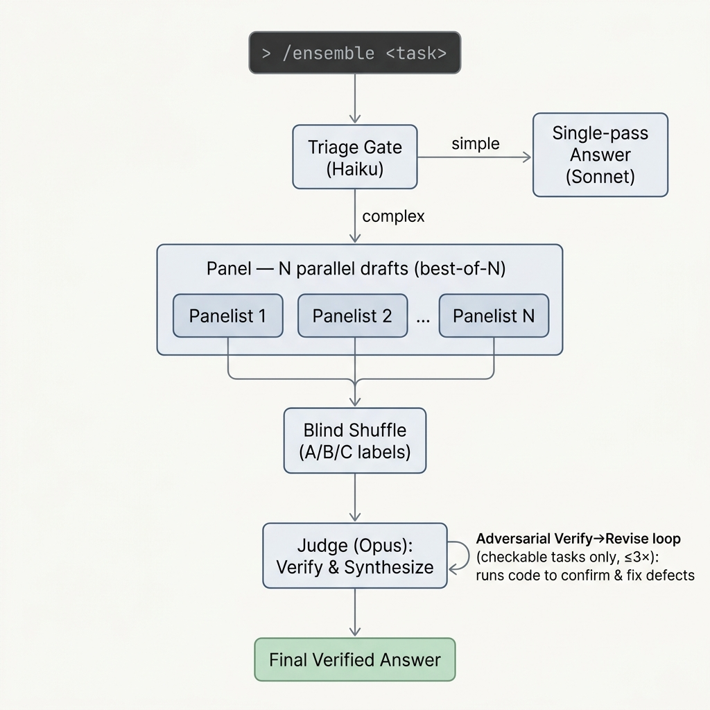
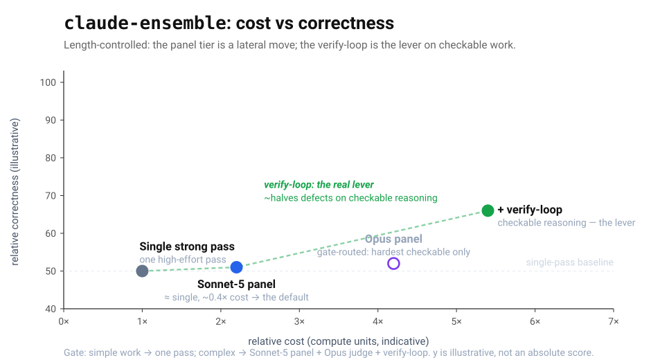

## Background

On June 9th, Anthropic released [Fable 5](https://www.anthropic.com/news/claude-fable-5-mythos-5), its most capable widely released model. The launch terms were explicit: free on paid plans through June 22nd, then removed from those plans after which using it would require usage credits. 

On June 12th, a US government export-control directive [suspended Fable 5 entirely](https://www.anthropic.com/news/fable-mythos-access) over a cyber "jailbreak." Two weeks later the pattern went industry-wide: OpenAI [limited its new GPT-5.6 models](https://techcrunch.com/2026/06/26/openai-limits-gpt-5-6-rollout-after-government-request-says-restrictions-shouldnt-be-the-norm/) to a small set of government-approved partners, and Anthropic's Mythos 5 was cleared only for a list of trusted organizations.

Rather than wait for it to come back, I built a maximum-performance setup from the tier that stayed.

## Who it's for

Almost everyone (outside the exclusive list) lost the frontier tier. claude-ensemble is for those people: a Claude subscriber who builds with Claude Code and keeps hitting problems where a single answer is not good enough. Most are **independent builders, solo founders, and early-stage teams,** on a subscription rather than API billing and committed to one provider.

Use claude-ensemble on your most ambitious tasks, such as the following where one strong pass is often insufficient:

- Systems and architecture design
- Debugging and root-causing stubborn failures
- Hard algorithms and data-structure problems
- Math and proofs
- Deep research and synthesis
- Subtle conceptual questions where precision matters

While it is not for quick or simple work, the kit routes easy tasks to a single pass, so you only pay the premium when it is really needed.

## claude-ensemble

[claude-ensemble](https://github.com/tyoon10/claude-ensemble) is a drop-in Claude Code kit. You type `/ensemble <your hard task>` and it runs entirely inside Claude Code on your Pro or Max plan. No API key, nothing metered separately.

The pipeline: a triage gate routes simple tasks to one pass and hard tasks to a panel, a verifying judge, and a code-grounded verify-loop.

It is built on Claude Code [Dynamic Workflows](https://code.claude.com/docs/en/workflows) and sub-agents, so the control flow is a local script that owns the orchestration, not a model improvising it:

- **Triage gate (Haiku).** A cheap first pass decides two things: whether the task is complex enough to need the ensemble, and whether it is *checkable* (has verifiable content that running code could confirm). Simple tasks get one pass and skip the rest, so you do not spend the premium where a single answer already wins.
- **Panel (Sonnet 5, best-of-N).** For hard tasks, several Sonnet-5 sub-agents answer the same task independently, in parallel. A Sonnet-5 panel matches an Opus panel on correctness at a fraction of the cost, so it is the default, and the gate escalates only the hardest checkable tasks to an Opus panel. These are independent attempts, not assigned roles, and the evals below show designed diversity does not help.
- **Judge (Opus, max effort).** The judge sees the drafts under blind, shuffled labels, verifies each rather than trusting it, discards unsupported claims, and synthesizes one answer better than any single draft. The judge is where the kit spends its strongest model, because that is where correctness is made.
- **Verify-loop (Opus).** A harsh verifier runs code to find confirmed defects, a reviser fixes exactly those, and it repeats until the answer is clean or three rounds pass. This is the part a single pass structurally cannot do. Its value is on long-form checkable reasoning, such as designs, proofs, and quantitative analysis. On self-contained tasks like writing one function or an exact numeric answer, a single strong pass is already correct, so the gate keeps those on the cheap path.

The kit selects models by tier alias (`opus`, `sonnet`, `haiku`), so it tracks and adopts latest versions of Claude model family with no edit.

## Experiments and results

The kit ships with a [blind A/B evaluation suite](https://github.com/tyoon10/claude-ensemble/tree/main/eval) run entirely on a Claude subscription.

Six controls keep the measurement trustworthy:

- **Blind grading.** Answers are scored under randomized labels with all provenance stripped, so no judge can favor a known source.
- **Both answer-orders.** Every comparison is graded in both orders and averaged, cancelling position bias.
- **Cross-family graders.** Two Claude judges (Opus and Sonnet) plus an independent non-Claude grader (Gemini 3.5 Flash), to rule out same-family preference.
- **Two scoring methods.** An absolute 0 to 100 rubric and a blind pairwise win-rate, so no single scale's quirks decide the outcome.
- **Length control.** A re-grading pass that strips the length bias pairwise scoring carries, so a longer answer cannot win on size alone.
- **Full reproducibility.** Each experiment is a Claude Code workflow with its raw JSON and chart script, every run kept in the repo.

Under those controls, the numbers hold up:

| Measure | Result |
|---|---|
| Panel vs a single matched-effort pass, raw blind pairwise | ≈ 60% win-rate |
| The same comparison, independent non-Claude grader | ≈ 62% win-rate (agrees) |
| The same comparison, length-controlled | mostly ties (the raw edge is largely length) |
| Sonnet-5 panel vs Opus panel, correctness | a tie, at roughly 0.4x the cost |
| Judge effort, raised on its own (the single biggest knob) | +2.4 rubric points |
| Verify-loop on checkable reasoning | roughly halves real defects |
| Draft diversity vs measured lift | uncorrelated (r = -0.11) |
| Panel breadth | saturates by about five drafts |

Two model families agreeing within two points (60% and 62%) shows the raw win-rate is not a single-family artifact. But length control is the honest read: most of the panel's raw edge is length, and it collapses to ties. What survives are the two real levers, **a high-effort verifying judge and the code-grounded verify-loop.** That is why the kit runs a cheap Sonnet-5 panel for coverage and spends its strongest model where correctness is actually made.

The gain is not the panel size. It is that independent attempts give the judge enough material to check, correct, and combine into an answer stronger than any single draft, and that the verify-loop then runs code to fix what a single pass leaves behind.

Each design at its real cost and correctness (length-controlled). The panel tier is a lateral move, so the kit runs a cheap Sonnet-5 panel and escalates only the hardest checkable tasks to an Opus panel. The verify-loop is the lever.

The trade is **cost**: a complex run adds a Sonnet-5 panel, a high-effort Opus judge, and the verify-loop, so it spends real Opus usage on the judge and verifier where correctness is made. Max effort is called for the most difficult challenges, and the triage gate keeps easy work off it, so you pay the premium only where it helps. The [full methodology trail](https://github.com/tyoon10/claude-ensemble/tree/main/eval), including every reversal, is in the repo.

## Conclusion

Access to the most advanced frontier models is moving towards exclusivity. For independent builders, claude-ensemble helps achieve frontier-level performance through orchestration and verify loop, so that more of the model's capability actually reaches the answer. The moat is not the model; it is the process you put around it.

claude-ensemble is open source under MIT, runs on a Pro or Max subscription with no API key, and adopts new Claude models automatically. I built it for Claude Code builders, including myself, who are solving problems that the current models alone cannot.
