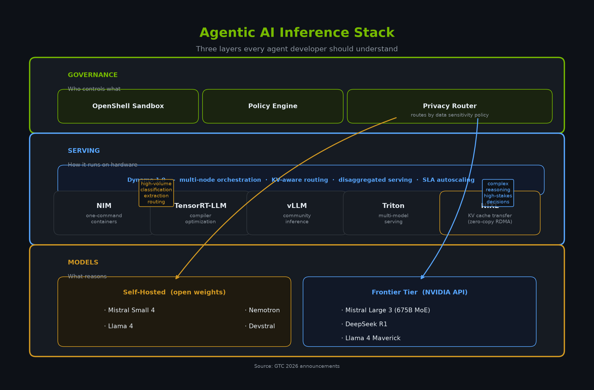
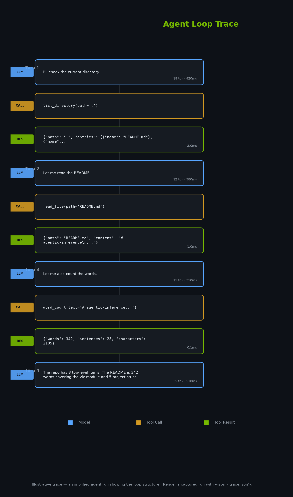
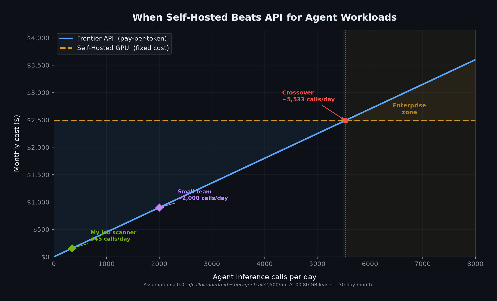
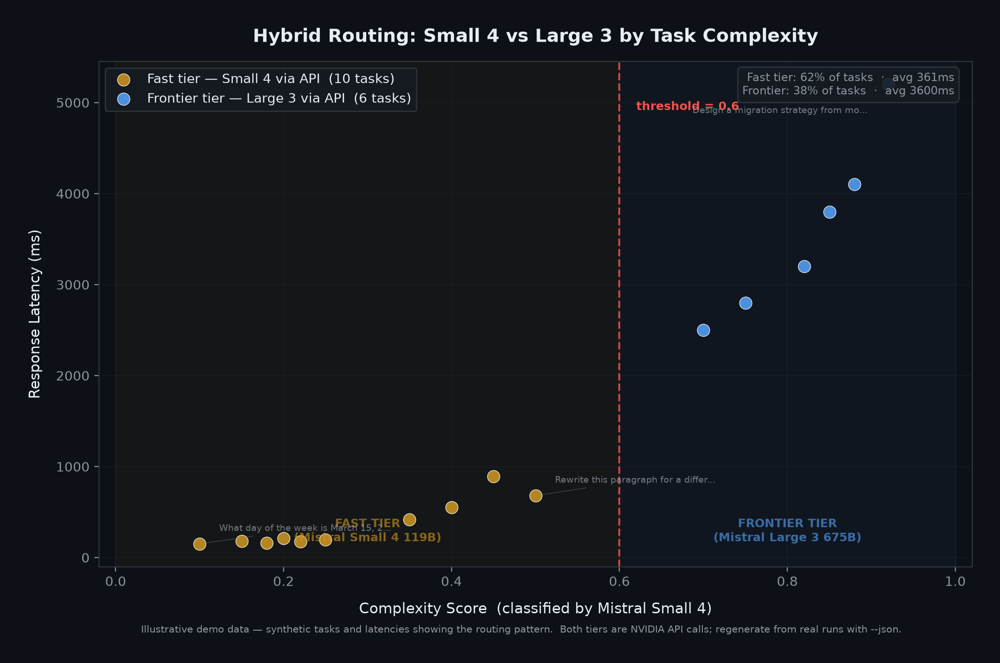
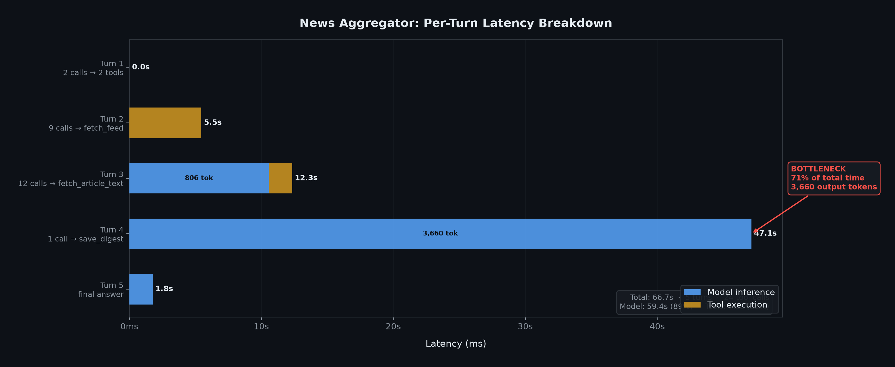

At 9 AM on February 28th, Verci Flatiron in Manhattan was already buzzing. Laptops open, monitors set up, French croissants on the tables. Builders settling in for [Mistral AI](https://mistral.ai/)'s first-ever Worldwide Hackathon: a 36-hour sprint running simultaneously across seven cities, from Paris to Tokyo. I was there as a judge.

But the most interesting thing I watched that weekend wasn't the demos. It was the infrastructure underneath them.

Some teams were running [Ministral 3](https://docs.mistral.ai/models/ministral-3-14b-25-12) locally: 14 billion parameters on a laptop, no cloud, no internet required. They iterated fast. They owned every layer of the stack. Other teams hit [Mistral Large 3](https://docs.mistral.ai/models/mistral-large-3-25-12) via API, and as their agents chained call after call (scraping, classifying, generating, evaluating), they watched rate limiters tick and token counters climb. The contrast was sharp.

In the same room, [NVIDIA](https://www.nvidia.com/)'s technical marketing team was helping builders navigate [NVFP4 quantization on Blackwell](https://developer.nvidia.com/blog/3-ways-nvfp4-accelerates-ai-training-and-inference/), optimizing inference for the projects being built in real time. I didn't fully appreciate what they were doing until later. They weren't selling GPUs. They were solving the inference problem that every agent builder in that room was about to hit.

Three weeks later, [GTC 2026](https://www.nvidia.com/en-us/gtc/). NVIDIA and Mistral shared a stage. Half the keynote was about infrastructure for agents, not chatbots. [Dynamo 1.0](https://github.com/ai-dynamo/dynamo). [OpenShell](https://developer.nvidia.com/blog/run-autonomous-self-evolving-agents-more-safely-with-nvidia-openshell/). [NIXL](https://developer.nvidia.com/blog/enhancing-distributed-inference-performance-with-the-nvidia-inference-transfer-library/) for zero-copy KV cache transfer across disaggregated workers. And on the keynote day itself, with day-0 NIM support, Mistral released [Small 4](https://huggingface.co/mistralai/Mistral-Small-4-119B-2603): a 119-billion-parameter sparse model that unifies instruct, reasoning, and agentic coding in one checkpoint.

The through-line clicked. **The hackathon showed me the problem. GTC showed me the answer.**

I didn't think about inference infrastructure until I watched it break: first on the hackathon floor, then in my own agent workflows. I built a job scanner that checks 23 company career pages daily: one task from the user's perspective, fifteen inference calls under the hood. Scale this to a team and the math stops working.

**The bottleneck in agentic AI isn't the model. It's the inference layer.** And the stack forming between [Mistral](https://mistral.ai/) and [NVIDIA](https://www.nvidia.com/), from open weights to optimized serving, is where the answer is taking shape.

The three-layer agentic AI inference stack, from models to serving to governance, with hybrid routing between self-hosted open weights and frontier APIs.

## It's Not the Model. It's the Inference Pattern.

Most infrastructure discussions focus on which model to use. The more consequential question is *how agents use models*, because it is fundamentally different from how chatbots do.

Consider three workflows I run regularly. Each one stresses infrastructure in a different way.

**The job scanner** is a parallel fan-out. Twenty-three companies checked simultaneously, each generating multiple inference calls for title filtering and job description classification. A burst of concurrent requests that hits API rate limits at exactly the wrong moment: mid-scan, with half the results in and half still pending. On self-hosted infrastructure, the constraint flips. Your GPUs, your concurrency ceiling. No external throttle.

**The meeting ingester** is sequential chaining. Fetch transcript, extract summary, identify action items, push to Notion. Four calls in strict series: each one depends on the output of the last. Latency compounds: two seconds per call means eight seconds of wait for something that *feels* like it should be instant. A chatbot takes two seconds. An agent chain takes eight. Same model, same hardware, four times the perceived latency.

**The evaluator loop** is iterative refinement. Draft a referral essay, evaluate against criteria, revise, re-evaluate. The same growing context reprocessed each pass, and the context *grows* with every iteration as prior drafts and feedback accumulate. Three iterations means three times the token bill for the same output. The model isn't doing three times the thinking. The infrastructure is doing three times the work.

Agents don't just make *more* calls than chatbots. They make *different kinds* of calls (bursty, sequential, iterative, unpredictable) often within the same task. Infrastructure designed for steady-state chatbot traffic can't handle this.

An illustrative agent run: one task ('read the repo and summarize it') generates 4 model turns and 3 tool calls. Each blue card is an LLM inference call. Each orange-green pair is a tool round-trip. A chatbot would be one blue card.

This is exactly what NVIDIA's [Dynamo 1.0](https://github.com/ai-dynamo/dynamo) targets: an orchestration layer that routes requests to GPUs with cached context and autoscales based on latency SLAs. More on that below.

## The Bill Is the Bottleneck

My job scanner runs 345 inference calls per day. At API pricing, it is a real line item. On a self-hosted GPU running [Mistral Small 4](https://huggingface.co/mistralai/Mistral-Small-4-119B-2603) via [NIM](https://build.nvidia.com/), the marginal cost per call approaches zero after the fixed hardware investment.

For a single developer, APIs win on simplicity. For a team running dozens of agent workflows daily, self-hosted wins on economics. For an enterprise with compliance requirements (finance, healthcare, defense), self-hosted isn't optional.

At ~5,500 agent calls per day, self-hosted GPU cost drops below API pricing. My job scanner sits at 345: well in API territory. A small team crosses the line fast.

But here's the thing. This isn't either/or.

Classification, extraction, routing? Those run on a 12-billion-parameter model without breaking a sweat. Multi-step analysis, ambiguous problem-solving? That's where larger models justify their cost. **The architecture that wins is hybrid: route easy calls to small, fast models; hard calls to frontier-class models.**

The entire routing stack can live under one API. [Mistral Small 4](https://build.nvidia.com/mistralai/mistral-small-4-119b-2603), a 119B sparse model with first-class agentic tool-calling, handles classification and the fast tier. [Mistral Large 3](https://build.nvidia.com/mistralai/mistral-large-3-675b-instruct-2512) (675B MoE) handles complex reasoning. Both served through NVIDIA's API catalog at `integrate.api.nvidia.com`. One key, one endpoint pattern, two tiers of intelligence.

Hybrid routing, illustrated: a classifier model scores each task's complexity (x-axis), then routes below the threshold to Mistral Small 4 (fast tier) and above to Mistral Large 3 (frontier tier). Simple tasks cluster left: fast and cheap. Complex tasks go right: slower but higher quality. Both tiers run through the same NVIDIA API.

NVIDIA's [AI-Q](https://developer.nvidia.com/blog/how-to-build-deep-agents-for-enterprise-search-with-nvidia-ai-q-and-langchain/) enterprise research blueprint runs Nemotron locally and GPT-5.2 via API in the same pipeline. [OpenShell](https://developer.nvidia.com/blog/run-autonomous-self-evolving-agents-more-safely-with-nvidia-openshell/)'s Privacy Router automates this routing based on data sensitivity policy, not developer preference. **The hybrid model isn't a compromise. It's the reference architecture from the company building the GPUs.** And when you're ready to self-host, the same models run on NIM containers with the same API: swap the URL, keep the code.

## The Infrastructure Layer Just Arrived

I am not going to recap the GTC keynote. Two announcements matter for anyone building agents today.

### Dynamo 1.0: the orchestration gap

In NVIDIA's own stack, multi-node inference previously meant hand-orchestrating [Triton](https://developer.nvidia.com/triton-inference-server); NVIDIA positions Dynamo as its designed-for-distributed successor. Dynamo coordinates inference engines ([TensorRT-LLM](https://github.com/NVIDIA/TensorRT-LLM), [vLLM](https://github.com/vllm-project/vllm), [NIM](https://build.nvidia.com/)) into a unified multi-node system. It routes requests to GPUs that already cached relevant context, cutting time-to-first-token in half. It separates prompt processing from token generation so each can scale independently. And it autoscales on latency SLAs: not fixed capacity, but actual performance targets.

Under the hood, Dynamo's disaggregated serving relies on [NIXL](https://developer.nvidia.com/blog/enhancing-distributed-inference-performance-with-the-nvidia-inference-transfer-library/), the NVIDIA Inference Transfer Library. When prefill and decode run on separate GPU workers, NIXL handles zero-copy KV cache transfer between them, the plumbing that makes disaggregated serving fast.

The headline number: **up to 7x the requests served** on the same Blackwell hardware, disaggregated versus aggregated serving, measured on [DeepSeek R1](https://huggingface.co/deepseek-ai/DeepSeek-R1). Built in Rust with Python extensibility: open source from day one. You don't need this for a single GPU. You need it when agent traffic becomes unpredictable at scale: when the fan-outs, chains, and loops from dozens of concurrent workflows collide on the same cluster.

### OpenShell: the governance gap

The enterprise blockers for autonomous agents aren't technical: they're trust. OpenShell moves safety controls *outside* the agent runtime. A deny-by-default policy engine that constrains file access, network calls, and subprocess execution at the OS level. Not in the system prompt. Not overridable by the model. [Claude Code](https://docs.anthropic.com/en/docs/agents-and-tools/claude-code/overview) and [Codex](https://openai.com/index/introducing-codex/) run unmodified inside it.

The Privacy Router is the part that makes the hybrid architecture real. It decides (based on organizational policy) which inference calls touch frontier APIs and which stay on local infrastructure.

**The pattern across both:** NVIDIA is not retrofitting chatbot infrastructure for agents. They are building infrastructure that understands how agents actually work: bursty traffic, shared context across calls, policy constraints on data flow. Purpose-built, not patched.

## Three Layers, Not One

The stack for agentic AI has three layers:

- **The model layer**: what reasons. Mistral Small 4 for speed, Mistral Large 3 for depth, Llama, DeepSeek. Open weights across the capability spectrum.
- **The serving layer**: how it runs. NIM containers, TensorRT-LLM optimization, NIXL for KV cache transfer, Dynamo for multi-node orchestration.
- **The governance layer**: who controls what. OpenShell, privacy routing, policy engines.

The developers who understand all three layers, not just the first, will build systems that are faster, cheaper, and actually deployable in enterprises that care about compliance and cost. That is the gap between a demo and a product.

I rebuilt the same agent workflows on the [NVIDIA](https://www.nvidia.com/) + [Mistral](https://mistral.ai/) open stack. One API key, two model tiers, zero vendor lock-in. Here's what I found.

## Update: Running Real Agents on NVIDIA's API

*Added April 1, 2026*

I put the theory to the test. Three working projects, all running on [Mistral Small 4](https://build.nvidia.com/mistralai/mistral-small-4-119b-2603) via NVIDIA's hosted API at `integrate.api.nvidia.com`:

**Project 1: Tool-calling agent loop.** The `while(tool_use)` pattern: the model decides which tools to call and when to stop. No hardcoded steps.

**Project 2: Hybrid router.** A complexity classifier routes easy calls to Mistral Small 4 and hard calls to [Mistral Large 3](https://build.nvidia.com/mistralai/mistral-large-3-675b-instruct-2512). One API key, two intelligence tiers. The same architecture NVIDIA's OpenShell Privacy Router implements at the infrastructure level.

**Project 3: AI news aggregator.** The most revealing demo. An autonomous agent that crawls 9 RSS feeds (OpenAI, Google, NVIDIA, DeepMind, Hugging Face, MIT Tech Review, arXiv, Anthropic, Mistral), identifies the most significant stories, fetches full article text, and compiles a structured markdown digest, all without human intervention.

Here's what a single run looks like:

| Metric | Value |
|--------|-------|
| Model | Mistral Small 4 (119B) via NVIDIA API |
| Turns | 5 autonomous turns |
| Tool calls | 24 total (date range, source listing, 9 feed fetches, 12 article extractions, digest save) |
| Input tokens | 79,449 |
| Output tokens | 4,664 |
| Total latency | 67 seconds |
| Bottleneck | Turn 4: 47 seconds. The model synthesizes 79K tokens of article data into a ranked digest |

The bottleneck is exactly what you'd expect from the inference patterns described above. Turns 1-3 are fast tool-calling bursts: short prompts, quick responses, parallel fan-out across feeds. Turn 4 is a massive sequential generation: the model processes the entire accumulated context and produces a 6,000-character digest in one pass. **This is the turn where Dynamo's disaggregated serving matters:** separating the prompt processing (79K tokens of prefill) from the token generation (4.6K tokens of decode) so each can scale independently.

Per-turn latency breakdown of the news aggregator agent. Turn 4 (where the model synthesizes 12 articles into a structured digest) consumes 71% of total execution time. This is pure model inference, not I/O. Infrastructure choices at the serving layer (quantization format, batch scheduling, disaggregated prefill/decode) determine whether this turn takes 47 seconds or 20.

Quantization matters here more than anywhere. [NVFP4](https://developer.nvidia.com/blog/3-ways-nvfp4-accelerates-ai-training-and-inference/), NVIDIA's 4-bit floating point format, delivers higher throughput than FP8 with accuracy within 1% of the FP8 baseline on most benchmarks, per NVIDIA's own numbers. For Turn 4's 47 seconds of pure model inference, the difference between FP8 and NVFP4 throughput is the difference between a minute-long workflow and a sub-30-second one.

The real learning wasn't the latency numbers. It was the integration friction. NVIDIA's endpoint rejects message fields that OpenAI's SDK includes by default (`audio`, `refusal`, `annotations`). The default `mistral-nemotron` model returns `finish_reason: "tool_calls"` with an empty tool call list, silently breaking the agent loop. Fixing these required reading error messages, testing model variants, and stripping unsupported fields from the message history.

The [companion repo](https://github.com/tyoon10/agentic-inference) includes all three projects with verbose agent logging, trace capture, and the fixes described above.

---

*Figures generated with [agentic-inference](https://github.com/tyoon10/agentic-inference), a companion repo demonstrating agent loops, hybrid routing, and autonomous news aggregation on the NVIDIA API catalog. Perspective informed by judging [Mistral AI's Worldwide Hackathon](https://hackiterate.com/mistral-worldwide-hackathons) (New York Edition, February 28 to March 1, 2026) and following [GTC 2026](https://www.nvidia.com/en-us/gtc/) announcements (March 16 to 19, 2026). Organized by Mistral AI, operated by [Iterate](https://hackiterate.com/).*
