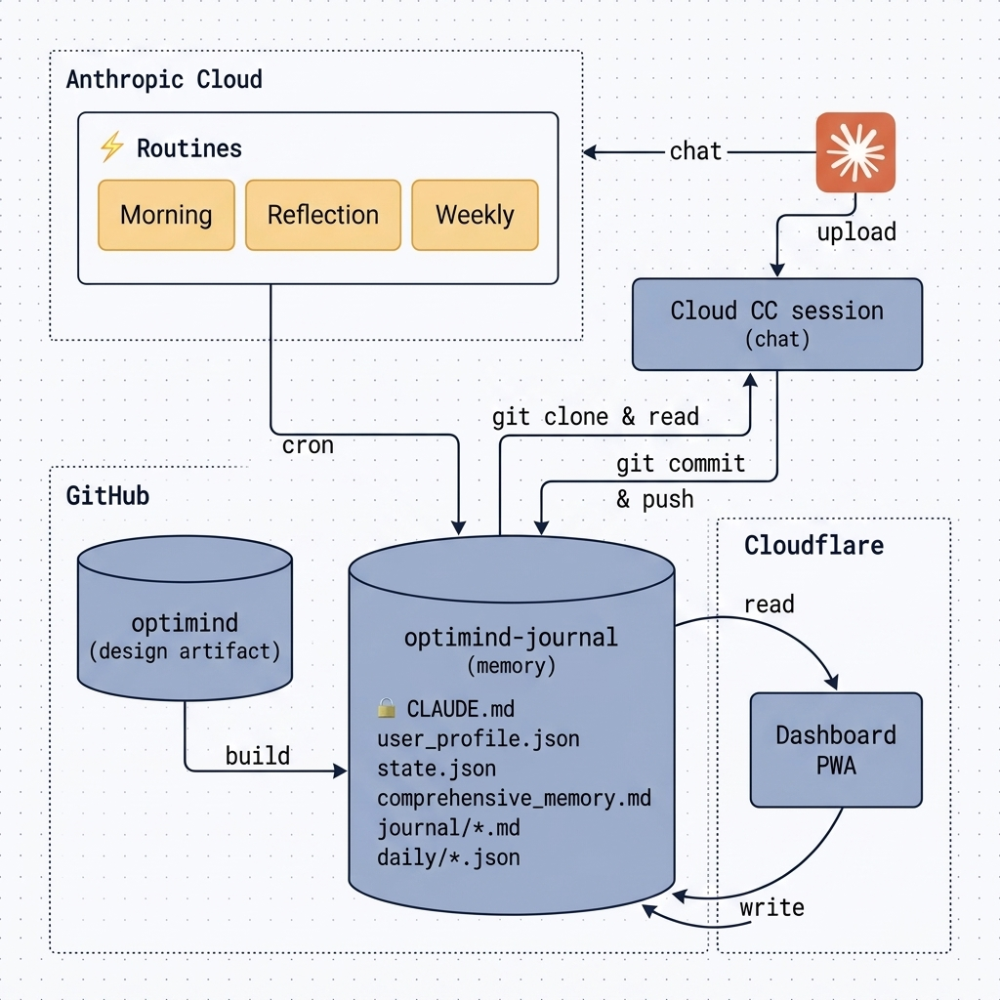
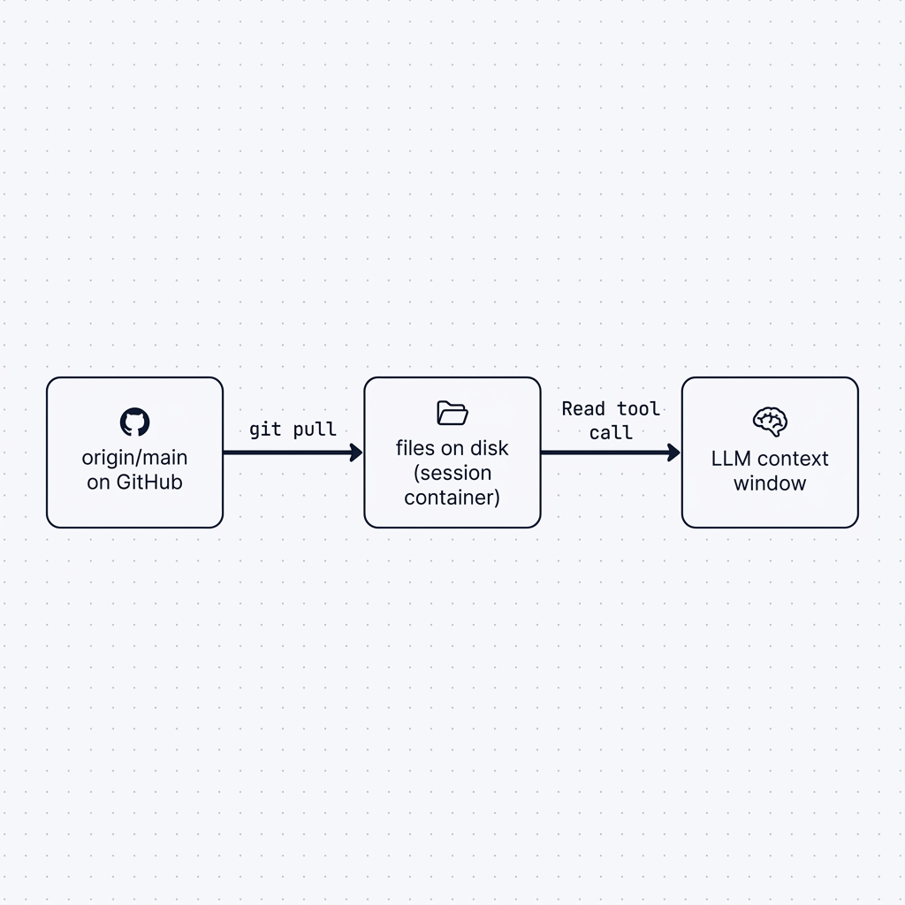
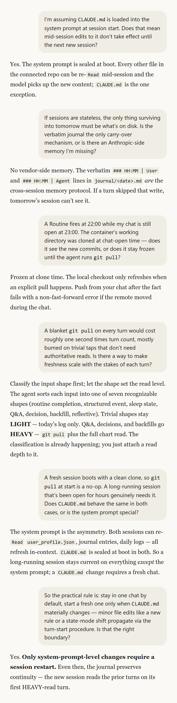
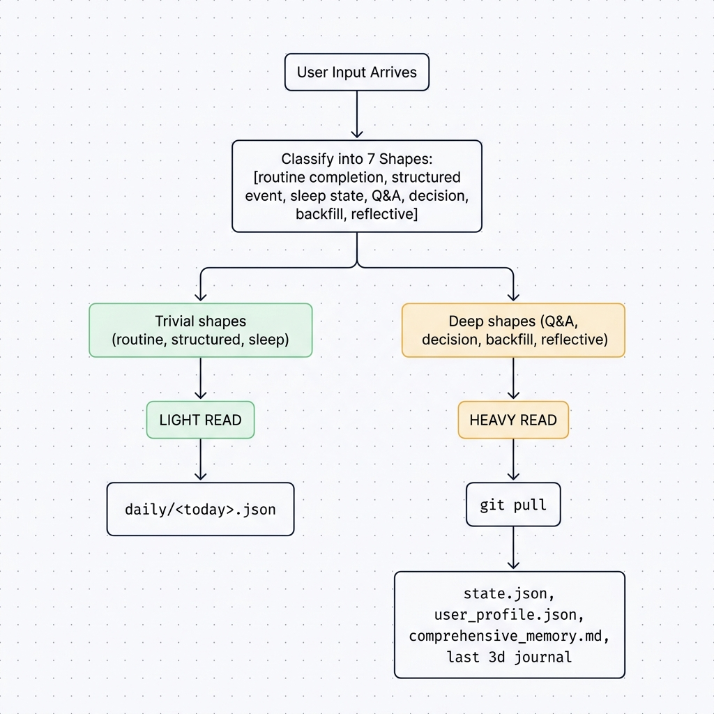

A friend in finance asked me a question recently that stuck with me. He wanted to carry an AI agent that understood his context through access to all his files, *with him, on the road*: between client meetings, between schedules. An executive assistant that travels with him through the day.

His first surprise was that this already exists. When I showed him the Code feature in the Claude mobile app, he hadn't known you could run Claude Code from a phone at all. Most people don't, so the feature stays underused. In a [recent interview](https://youtu.be/SlGRN8jh2RI?si=pgKLycpE7T1l0JTN), Boris (creator of Claude Code) mentioned he now does most of his work directly from his phone. That was when it clicked for me: the coding assistant, your terminal companion, is becoming a mobile-first general agent.

But his real question was harder than "what's possible." Running Claude Code from a phone isn't the hard part. The hard part is making Claude *remember* across sessions, and I'd spent the past month working through it. Here's what I learned, and what I ended up building.

## From VS Code to the Phone: Why the Surface Matters

If you use Claude Code, the desktop loop is familiar. You open an IDE, the model reads your documents and codebase, and you review its output and accept in-line edits.

As models get better (and the recent Opus 4.8 release is a real jump), the work shifts toward **delegation**. You spend less time reviewing lines of code and more time reviewing *decisions*: the documentation, the rationale, the architecture. Reasoning in natural language instead of code is a shift in **system thinking**, a different way of using your brain to build a system.

Moving that loop onto a phone changes it in three ways. It becomes **iterative**: turn latency drops to near-zero, tap-read-tap-read, and the session feels like thinking out loud rather than composing a prompt. It becomes **spontaneous**: you capture intent the moment it arises, mid-walk or after a workout, before the gap bleaches it out. And it becomes **integrated**: the phone is a sensor. Camera, clipboard, screenshots, recent chats and emails all paste in with a tap.

Mobile is a great surface. But it exposes a problem the desktop quietly hides: **every session is ephemeral**. You ask a question, Claude (or Gemini or GPT) gives you a response. But the chat does not automatically build its memory given your inputs. So how do you carry the context with you?

## What I Tried to Build

I have been building **OptiMind**, a personal performance coach over the last few months. The goal is to optimize my daily protocol in every way (circadian rhythm, deep work, meal and supplements, workout) with coach-grade reasoning over my own data. Given my need to interact with the agent during the day (updating schedule changes, logging meals and workout, etc.) I needed to access the whole system directly from my phone.

The architecture is two repos: 

[`optimind`](https://github.com/tyoon10/optimind) (public) holds the *system*

Canonical schemas, the paste-ready prompts for the scheduled routines, a dashboard PWA, and the design doc with the engineering history that produced everything else. 

`optimind-journal` (private) holds the *memory*

The active system prompt at `CLAUDE.md`, `user_profile.json` (durable rules), `state.json` (current mode), `journal/YYYY-MM-DD.md` (verbatim conversation), `daily/YYYY-MM-DD.json` (structured logs), and a `comprehensive_memory.md` of first principles. 

The split is the abstraction line: *system* is the code and the patterns, *memory* is the user's data.

There are three surfaces: the Claude mobile app as the primary chat, three scheduled cloud [Routines](https://code.claude.com/docs/en/routines) (a Morning Brief, a Nightly Reflection, a Weekly Review), and a static PWA dashboard for structured logging. **There is no local machine and no 24/7 host.** Everything is Anthropic cloud plus GitHub.

The files in optimind-journal are the memory. Every cloud session, Routines and chat alike, clones the repo fresh from GitHub. CLAUDE.md is sealed into the system prompt at session start; every other file can be re-read mid-session.

## Memory Is a Hard Problem

It took me months to internalize this. What *looks* like one continuous relationship with an AI assistant is really a sequence of disconnected, ephemeral sessions. The model has no persistent state, and even within a session the context window gets compacted as it fills. If you want to give your agent a memory, **you have to be intentional to build it**, somewhere that survives the session.

The problem has three sources.

**Sessions are stateless caches, not minds.** Each new chat is a fresh container, a fresh clone, a fresh model with no recall of anything prior. There is no Anthropic-side "show me what I discussed yesterday" knob. The conversation in the tab is the *entire* memory of the system, and it dies when you switch out of it.

**Files are the only durable layer.** For continuity to exist, every substantive turn has to be **written to a file in a place the next session will clone**. The git repo connected to your session is that place. For OptiMind, if a fact didn't make it into `journal/*.md`, `daily/*.json`, `user_profile.json`, or `state.json`, it doesn't exist for tomorrow.

**"File on disk" is not "in the model's context."** Even when the files are perfectly up to date on the container's disk, the model **doesn't see them** until an explicit `Read` call pulls their bytes into the conversation. The model reasons only on what's in its context window, and that explicit Read call is what informs the agent the context that matters. Two operations have to compose:

`git pull` refreshes the files. `Read` refreshes the context. Both are required; neither is sufficient alone.

git pull moves truth onto disk; Read moves disk into the model's context.

That framing produces three concrete failure modes the architecture has to handle:

| Failure mode | What goes wrong | Mitigation |
|---|---|---|
| **Stale clone** | A long-lived chat's files are frozen at clone time while `origin/main` moves on (a Routine fires; another tab pushes) | `git pull` on substantive turns |
| **Stale read** | Files are current on disk, but the model answered from internal recall instead of reading them | Mandatory `Read` calls on substantive turns |
| **Lost history** | A turn never made it into `journal/<date>.md` and is invisible to the next session | Verbatim-first write contract + dual-write of structured facts |

## How the Solution Emerged

I worked the design out in conversation with Claude itself, asking how each piece actually behaved and correcting my assumptions. Here's that exchange, recreated.

Each of my questions exposed an assumption; each of Claude's answers became one of the load-bearing rules below.

Here's the rationale behind *classifying the input first* (the fourth exchange). Both naive policies fail: 'reading the full chart on every turn' makes a trivial logging turn needlessly slow and expensive, while 'reading nothing' leaves the agent guessing (and hallucinating). So I made the turn-start branch on intent. The LLM sorts each input into one of seven shapes, and the shape sets the read depth: trivial shapes stay **LIGHT** (today's log only), high-stakes ones go **HEAVY** (`git pull` plus the full chart).

Classify the input shape first, then load. Light shapes stay cheap; heavy shapes pay for fidelity with a git pull and a full chart read.

## The Decisions, Distilled

Strip away OptiMind and a transferable playbook remains:

1. **Files are the memory; sessions are stateless caches.** Don't try to make the bot *remember*; make the files authoritative and the bot disciplined about reading it.
2. **The dual-write contract.** Every structured fact lands in both `daily/<date>.json` *and* `journal/<date>.md` as a mirror line, the same contract whether the writer is the chat agent, a Routine, or a dashboard form.
3. **Critical write rules live in CLAUDE.md.** Branch is always `main`; exact file paths only; re-read `user_profile.json` before naming any specific rule. Encoded once in the system prompt, binding on every session.
4. **The seven-shape input playbook drives an intent-keyed turn-start.** Classifying the input is the first cognitive step every turn anyway, so each shape carries both a dual-write action *and* a read level (LIGHT / LIGHT+ / MEDIUM / HEAVY, with `git pull` only on HEAVY). Trivial turns stay cheap; high-stakes turns pay for fidelity.
5. **Verbatim-first writes.** Append the user's input to `journal/<date>.md` verbatim, before the response is finalized and committed. If anything fails between the turn's start and the push to `main`, the input is already in the audit log — and tomorrow's session reads it like nothing happened.
6. **CLAUDE.md is standing orders; everything else is the chart on the wall.** That single asymmetry, sealed at start versus re-readable mid-session, is what drives the user-side rule: **continue in one chat by default; start a fresh one only when CLAUDE.md materially changes.** This ensures the system prompt always tracks what's on disk.

## What This Means for Anyone Building with Claude Code

**Your repo is your durable memory.** The connected GitHub repo is the only thing that survives the session. Design what lives there as a database schema.

**CLAUDE.md is your highest-leverage lever.** Every new session reloads it. Every Routine fire reloads it. Every edit propagates to every future session. So you should spend 10x more time on it.

**Don't make the session remember; make it disciplined at *reading*.** The model has no memory between sessions. Your only knobs are what you write to files and the reading procedure you encode in the system prompt. Instead of fighting statelessness, build to benefit from it, since every session starts fresh and clean.

**Verbatim capture is the protocol.** Whatever the user types *is* the record. The agent's job is to log it faithfully and respond on top of it. Verbatim layer as a source-of-truth is what ensures continuity.

## See the system

The OptiMind system repo is public: **[github.com/tyoon10/optimind](https://github.com/tyoon10/optimind)**. The personal data layer — rules, journal, daily logs, the active `CLAUDE.md` — stays in a private companion repo; the public side is the system architecture, not the data. The [README](https://github.com/tyoon10/optimind/blob/main/README.md) encodes the same governance rules I've used here, including a what-lives-where table for the two-repo split.

If you want to trace where each idea in this article actually lives:

- **The schemas** that make the dual-write contract concrete: [`schemas/daily_log.schema.json`](https://github.com/tyoon10/optimind/blob/main/schemas/daily_log.schema.json), [`schemas/journal_entry.schema.md`](https://github.com/tyoon10/optimind/blob/main/schemas/journal_entry.schema.md), [`schemas/user_profile.schema.json`](https://github.com/tyoon10/optimind/blob/main/schemas/user_profile.schema.json).
- **The three scheduled-Routine prompts** in their paste-ready form: [`routines/morning_brief.md`](https://github.com/tyoon10/optimind/blob/main/routines/morning_brief.md), [`routines/reflection.md`](https://github.com/tyoon10/optimind/blob/main/routines/reflection.md), [`routines/weekly_review.md`](https://github.com/tyoon10/optimind/blob/main/routines/weekly_review.md).
- **The dashboard PWA**: [`dashboard/`](https://github.com/tyoon10/optimind/tree/main/dashboard) — SvelteKit + GitHub OAuth (PKCE) + a Cloudflare Pages Function for the token exchange.
- **The reference implementation of the dual-write logic** in Python: [`optimind-sdk/src/tools/daily.py`](https://github.com/tyoon10/optimind/blob/main/optimind-sdk/src/tools/daily.py).
- **The full design doc** — every architectural choice in this article traces back to a section: [`docs/USER_FLOW_PLAN.md`](https://github.com/tyoon10/optimind/blob/main/docs/USER_FLOW_PLAN.md). The doctor-and-chart first-principles framing is §4.7; the memory persistence model is §4.8; the 7-shape input playbook is §4.2; the intent-keyed turn-start procedure is §6.5; the engineering decisions log (where each of these patterns was decided and why) is §9. Both the playbook (§4.2) and the turn-start procedure (§6.5) are mirrored into the runtime journal's private `CLAUDE.md`, where they actually drive the agent.

---

Instead of training a chatbot, think of building a clinic. The doctors come and go; the chart persists.
