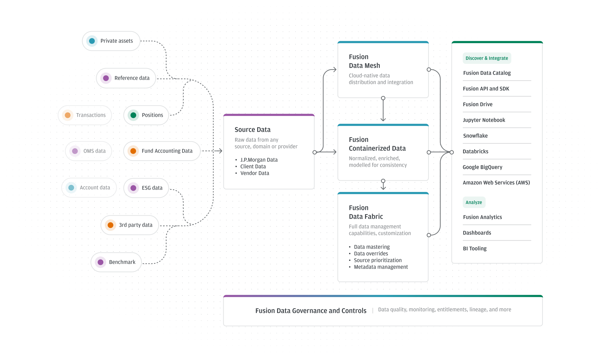
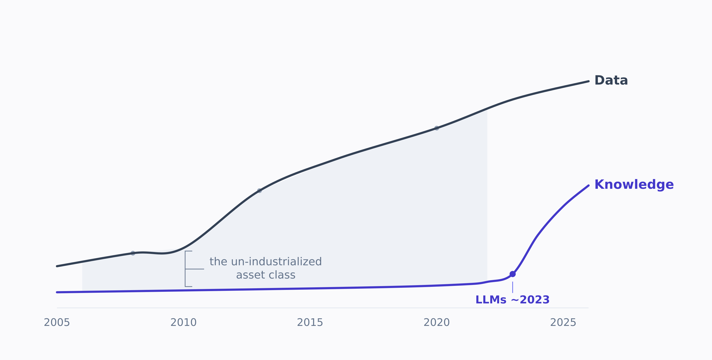
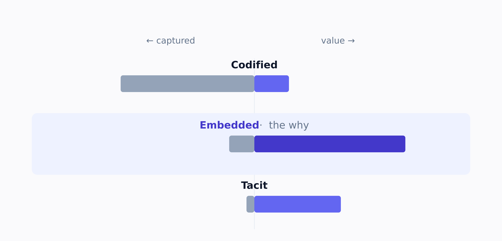
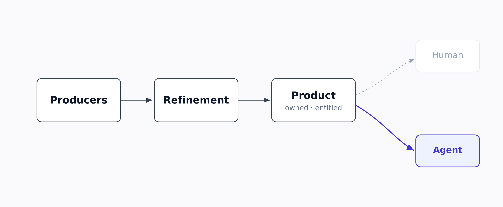
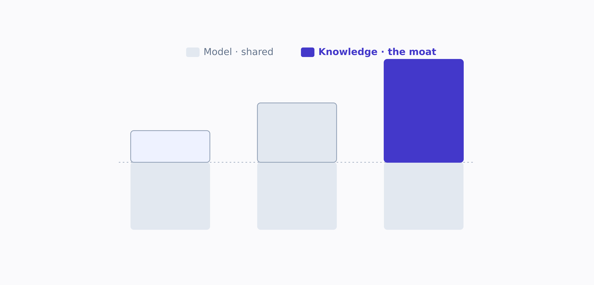
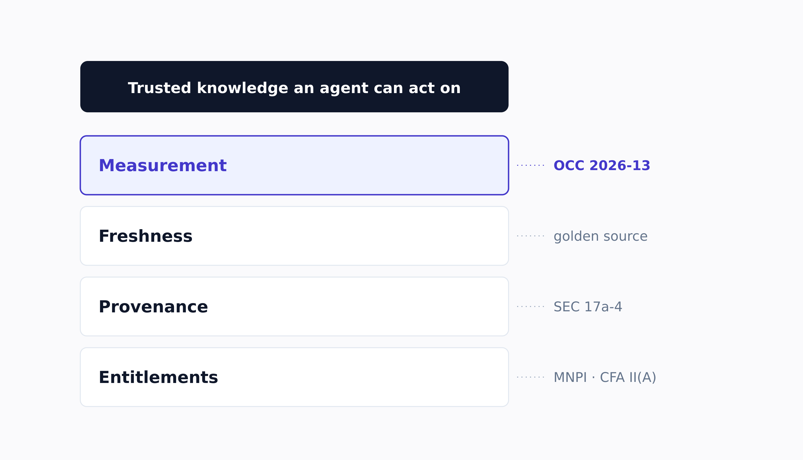
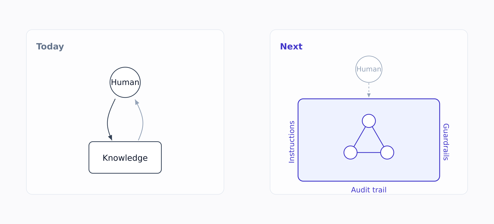

Early in my career, I owned a data room for a client (a major Korean conglomerate) selling a stake to a private equity firm. Due diligence was people and time, measured in the hourly rates of corporate attorneys, accountants, and investment bankers. The buy-side law firm sent request lists, and I worked them by hand, finding the contract, the board minute, the clause that settled each question, then deciding what the buyer was cleared to see before it crossed into the room. (You can hold material information and *still* be barred from acting on it.)

At Columbia Business School, Howard Marks took me back into that data room during his private credit lecture. He kept returning to the value private investing overlooks: not the record everyone can read, but the reasoning that produced it (discussed below). Looking back on that stake sale, the deal almost never turned on the volume of what we handed over; it turned on a handful of facts, and on the one thing the room rarely held: *why* management had decided what they decided. The contract said what was agreed; the financials, what happened. The reasoning behind both lived in people's heads and in email threads no one had filed.

I was a human retrieval system for someone else's high-stakes judgment. I now build the machines that do that work: retrieval and knowledge-graph systems that put AI on top of a firm's own knowledge. Having lived both sides of this transition, here is my framework for **knowledge** in finance under AI: **data**, the **value** that makes it a moat, the **constraints** that decide whether it can be trusted, and the **stakeholders** who decide everything else.

---

## Knowledge is the "Asset Class" Finance Never Standardized ... Yet

Banks standardized data. Golden sources, lineage, catalogs, master data. They did it because they were forced to: after the financial crisis, [BCBS 239](https://www.bis.org/publ/bcbs239.htm) made traceable, accurate, complete risk data a supervisory requirement, and as of the most recent assessment only a small minority of the world's roughly 31 systemically important banks were judged fully compliant. Platforms like [Fusion by J.P. Morgan](https://fusion.jpmorgan.com) are the visible result: take custody, accounting, and vendor data, [harmonize it into one common semantic model](https://siliconangle.com/2025/06/04/data-management-fusion-snowflake-snowflakesummit/), and deliver it into [Snowflake, Databricks, and notebooks](https://www.jpmorgan.com/about-us/corporate-news/2023/securities-services-fusion-data-mesh). The result was standardized data.

Fusion in one view: any source, normalized into a single model, delivered into the client's own stack. Adapted from <a href="https://fusion.jpmorgan.com" target="_blank" rel="noopener">J.P. Morgan's Fusion architecture</a>.

Knowledge received less investment. It remained in people’s heads, presentations, email, and shared drives. The main barrier was cost. A person had to read each document and decide what it meant. LLMs lowered the cost of first-pass extraction. They did not remove the cost of review, access control, or validation. Firms can now manage more of this material as an operating asset.

Finance standardized its data over twenty years. Knowledge remained unmanaged until LLMs reduced the extraction cost.

## I. Data: Three Tiers, and the Valuable One Is the One Nobody Captures

Not all knowledge is the same, and its value is inverted from the effort it takes to capture.

| Tier | What it is | Where it lives | How well it's managed | Relative value |
|---|---|---|---|---|
| **Codified** | Documents, research, policies, contracts, filings | Document stores, the data room | Half-managed already | Baseline |
| **Embedded** | Decisions, and the rationale behind them | Tickets, PRs, threads, meeting notes, deal memos | Barely captured | **Highest** |
| **Tacit** | Judgment, pattern recognition, relationships | People's heads | Not captured by tools at all | Situational |

Value runs opposite to capture. The embedded <em>why</em> is the highest-value tier and the least captured.

The contract says *what* was agreed. The thread says *why*. The next person making a decision needs the *why*, and the *why* is exactly what no system holds. In the data room, the embedded layer was the gap I kept hitting. I could find every number. I could almost never find the reasoning that produced it.

Data-product practices also apply to knowledge. Each domain needs an owner. That owner must define quality, freshness, provenance, and access. The firm also needs a standard retrieval method.

The user is no longer always a person. An agent may retrieve the material through an API. The content therefore needs structure, clear provenance, and stable permissions. Those properties also help human users.

Run knowledge like a data product (owned, measured, entitled) and design for the consumer that now matters most: an agent calling an API.

## II. Value: The Model Is the Commodity, the Knowledge Is the Moat

Every firm can buy the same model. None can buy a hundred years of its own deal history, research, post-mortems, and client context. So the competitive question is not which model you license. It is **who feeds their model the highest-quality proprietary knowledge, fastest and safest.** That sentence is what "make data AI ready" actually means.

Marks's CBS lecture is where it got concrete for me. He built Oaktree into one of the world's largest credit investors, and the striking thing is what the edge was not. In private credit the data is thin and everyone reads the same agreements. The edge was *second-level thinking*: "a superior ability to figure out what the readily available quantitative information implies," the judgment about which borrower survives the cycle and which does not.

What stayed with me was his discipline of writing it down. For thirty-five years he has published [memos](https://www.oaktreecapital.com/insights/memo/the-best-of) that record not what he decided but why he decided it, and they became essential reading across the industry. Sitting in that room, I realized he had spent a career doing the thing this essay is about, by hand. The data room had taught me the *why* was the valuable part; Marks made me see it was the defensible part. This essay is the same move: the reasoning, written down before it slips back into people's heads.

His definition of the machine, that day, was deflating: "a nerd that has read everything that's ever been written, remembers it, and can find it right away." It can read every credit agreement in a portfolio in minutes. What it cannot do is sit down with five CEOs and figure out which one is Steve Jobs. In private markets especially, the moat was never the documents. It was the **reasoning** almost no one bothered to write down.

An LLM can read every agreement in minutes; that's first-level. The moat is the second-level judgment about what they mean.

Cheaper extraction does not make all knowledge equally valuable. A firm should assess a source by its effect on decisions. It should also account for leakage, staleness, and error.

Structure is expensive. Ontologies and knowledge graphs require ongoing maintenance. Use them only when relationships between facts improve the answer. Document retrieval with citations may be enough for other questions.

## III. Constraints: In Finance, the Constraints Are the Architecture

Generic knowledge management treats compliance as friction to route around. In finance it is the opposite. The constraints are essential. Three of them shape every real design decision.

In finance the constraints are the architecture. Each layer is essential. Each is anchored to a rule. The evaluation layer carries the most weight today.

**Access is not uniform.** The same question must return different answers depending on who asks. This is not a product preference; it is the law. I first learned it by hand in that data room, and it is written into the [CFA Code I was tested on](https://www.cfainstitute.org/standards/professionals/code-ethics-standards): a charterholder cannot act on material nonpublic information, and firms must "enact a firewall to restrict the flow of proprietary information." Information barriers and [the Advisers Act's prohibition on misusing nonpublic information](https://www.law.cornell.edu/uscode/text/15/80b-4a) mean entitlements have to be enforced at query time and inherited from the source, never bolted on afterward. A knowledge system that can leak across a wall does not have a quality problem. It has an incident.

**Nothing unattributable is actionable.** A synthesized answer with no provenance is a regulatory event waiting to happen. In diligence, a number that did not trace to a source document did not go in the model, full stop. The same rule now governs AI output: [S&P's Document Intelligence](https://press.spglobal.com/2025-10-22-S-P-Global-Redefines-Financial-Insights-with-New-AI-Powered-Multi-Document-Research-and-Analysis-Tool-in-Capital-IQ-Pro-ChatIQ) sells "precise citations for full auditability," and [FactSet's](https://www.factset.com/marketplace/catalog) assistant sells "auditable answers." Citation is not UX polish. It is what makes the answer usable at all, and [SEC Rule 17a-4](https://www.smarsh.com/regulations/sec-rule-17a-4-records-preservation/), enforced with over $600 million in penalties across 70-plus institutions in fiscal 2024 alone, is the reason keeping a record of that output is not optional.

**Knowledge decays and contradicts itself.** At a few hundred thousand employees, the corpus disagrees with itself. In a markets business, knowledge has a shelf life: last quarter's research view or risk limit can be worse than nothing. The system needs what golden sources gave data: authority tiers (authoritative versus anecdotal), supersession (this policy replaces that one), and valid-from / valid-to dates. Most of what gets called a "RAG quality problem" is unmanaged conflict and staleness.

Underneath all three sits a simple rule: **if you can't measure it, you can't run it.** Teams measure groundedness, freshness, coverage, and retrieval quality continuously. Each measure gets an SLO. The evaluation runs again as the corpus grows. Because trust here is binary.

> The third hallucinated answer is the last query that managing director ever runs. You do not get them back.

The regulatory frame is still catching up to this. [OCC Bulletin 2026-13](https://www.occ.treas.gov/news-issuances/bulletins/2026/bulletin-2026-13.html) explicitly places generative and agentic AI *outside* the established model-risk guidance, which means for now the eval harness is the only guardrail that is essential. The firms that understand that are building it first.

## IV. Stakeholders: The Part That Actually Decides It

Everything above is necessary. None of it is sufficient. I have seen well-architected systems fail and plainer ones win, and the difference was never the architecture. It was whether the people on either end of the pipe had a reason to use it. **Knowledge systems are won and lost on stakeholders.**

| Stakeholder | What they actually need | What fails if you ignore them |
|---|---|---|
| **The producer** (analyst, engineer, PM) | Capture as a byproduct of work, not extra work | The high-value *why* never gets written down |
| **The consumer** (increasingly an agent) | Structured, atomic, traceable, entitlement-aware data | Human-first design that machines can't consume |
| **The gatekeeper** (compliance, the barrier) | Enforcement at query time, inherited from source | A leak, which is to say an incident |
| **The skeptic with authority** (the MD) | Answers correct enough to trust by the third try | One bad answer and the user base evaporates |
| **The underserved adopter** (a smaller desk, another region) | A real, sharp problem visibly solved | An attempt to structure everything proves nothing |
| **The agent** (software able to take actions) | Knowledge as instructions, permissions, and audit records | Autonomous work without governing rules or records |

A few of these deserve more than a row.

**Producers.** The highest-value knowledge, the *why*, only gets captured if writing it down is a byproduct of doing the work. You cannot extract tacit knowledge with a tool. You change the workflow so the artifact falls out of it. Software engineering solved this culturally long before anyone called it knowledge management: the commit message, the pull request, the design doc are all the *why*, captured as a side effect of shipping. That is why coding agents are the cleanest reference model for where this is heading.

**The underserved adopter.** Adoption follows pain, not the org chart. The instinct is to start with the biggest line of business. The better move is to start with the group whose pain is sharpest and whose alternatives are worst, often a smaller team or a different region that technology has underserved. They adopt fastest, prove the value, and create the pull that the marquee desks will never give you on faith.

**The agent as a stakeholder.** Today, knowledge systems retrieve: a human asks, the system answers. Next, agents *act* on knowledge, and the knowledge base becomes their operating instructions, their guardrails, and their audit trail. JPMorgan put an internal LLM assistant in front of [roughly 200,000 employees](https://www.artificialintelligence-news.com/news/jpmorgan-chase-ai-strategy-2025/) within months. On the supply side, the late-2025 convergence on Model Context Protocol servers sends the same signal: [Snowflake](https://www.snowflake.com/en/news/press-releases/snowflake-unveils-cortex-ai-for-financial-services--enterprise-ready-ai-built-to-scale/), [LSEG](https://news.microsoft.com/source/2025/10/12/lseg-and-microsoft-transform-access-to-ai-ready-financial-data-in-customer-workflows/), [Morningstar and PitchBook](https://newsroom.morningstar.com/news/news-details/2025/Morningstar-and-PitchBook-Bring-Trusted-Investing-Intelligence-to-Apps-in-ChatGPT/default.aspx), and [Arcesium](https://www.alternativeswatch.com/2025/12/15/arcesium-aquata-launch-new-ai-features/) all shipped one inside a single quarter. The consumer of financial data stopped being only human. The firm whose knowledge is structured, entitled, fresh, and evaluated is the one that can let agents act safely at scale first.

Here is what owning that data room taught me, and what I keep coming back to: the deliverable was never the pile of documents I assembled. It was whether the people on the other side of the deal could reach a decision they could defend to their own investment committee. A document nobody could trust or trace was worth nothing to them, however neatly it was filed. Knowledge systems are the same. The deliverable is never the retrieval. It is a defensible action that a specific, accountable person (or now, a specific agent) can stand behind. That is why stakeholders come last on the list and first in importance.

## Where This Goes

I began my career between evidence and decision. I now build systems that connect them. The scale has changed. Firms must make internal knowledge usable by people and agents. They must also preserve permissions and audit records.

Today, knowledge answers questions. Next, it provides the instructions, permissions, and audit records that govern an agent.

A strong model is not enough. Agents also need reliable internal knowledge. That knowledge must be current. It must carry provenance and permissions. Finance can now build these systems. And I think it is the most interesting thing in the industry.

---

*I left one question open here: once you decide to keep the reasoning, what form should it take? I answer it in the follow-up, [What Form Should Knowledge Take?](/writings/what-form-should-knowledge-take)*
