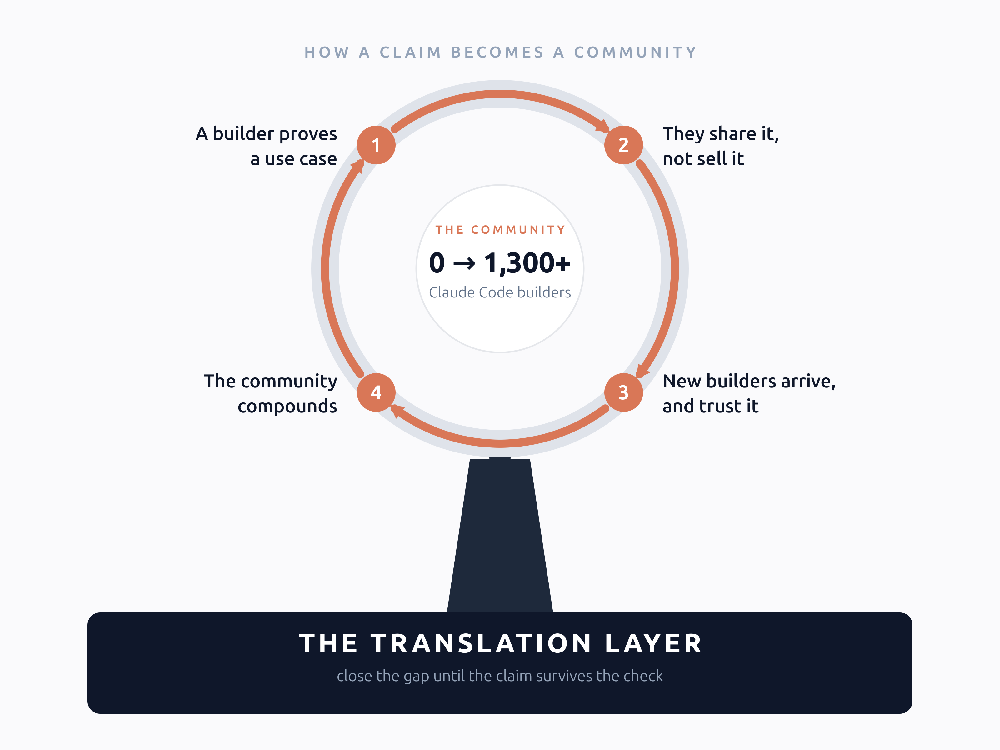

Last September I set up a folding table and a laptop on Columbia's campus. I had just joined the first global cohort of Anthropic's Claude Ambassadors. The assignment for week one was simple: get people to stop. One in three students on campus had never heard of Anthropic. One asked me, in complete seriousness, whether "the Cloud" was a new ChatGPT model. (if I had brought up the word 'Anthropic', pretty sure they would have walked away)

I assumed my job was attention. It was not. On a campus in the middle of an AI boom, attention is free. The real problem showed up later, in smaller rooms with sharper audiences. It took me 40+ sessions to name it.

### 'Hello', '밥 먹었니? (Did you eat?)', '元気? (Healthy?)' are the same thing

A room of [product managers who wanted to build with AI instead of around it](/writings/ai-superpower-for-pm/). A hall of [Directors and C-suite leaders at Columbia's executive AI program](/writings/what-senior-business-leaders-ask-about-ai/). Engineers already shipping to production. On the surface, three completely different audiences. In practice, eventually I was discovering a recurring pattern. **Every room checked my work. Each one just checked it in its own language.**

* The engineers were the literal version. In a hands-on workshop, everything I claimed got run within minutes. Either it worked or I lost the room. 
* The executives never touched a laptop. Their questions were the same test in a different dialect: who carries the liability, what happens to their talent, where the competitive advantage goes. They were checking my story against the businesses they run. That is the one system they know cold. 
* The product managers checked it against the one thing a PM fully trusts: their own workflow.

### The hardest marketing problem

That is where the lesson landed. **The hardest marketing problem in AI is not getting attention. It is being believed by people who can check your work.** And everyone worth reaching can check it. The form changes from room to room. The principle never does.

That seam has a name in my head: the **translation layer**. It is the gap between what a system can do and what a person understands they can now do with it. It is the foundation the rest of this work sits on. A claim that does not survive the check never gets to become anything else.

Being believed there changed how I make claims. At Mistral's worldwide hackathon I spent a 36-hour sprint watching builders hit inference ceilings. So I went home and wrote about [the serving layer underneath agent stacks](/writings/agents-need-better-infrastructure/). For that audience, a measured claim is the only kind that counts.

I wanted to say my panel-and-judge kit reached frontier-level output on a plain Claude subscription. I did not say it until blind, length-controlled A/B evals said it first. Then I shipped [claude-ensemble](https://github.com/tyoon10/claude-ensemble) with the eval results in the README. **The eval was the marketing.** (because that's what earned the trust)

Later I wanted to speak credibly about Claude Code itself. So I spent a weekend [reading two versions of its source tree side by side](/writings/tracing-the-minds-behind-claude-code/), 13 months apart. You cannot fake fluency to people who live in the system. You can only earn it.

None of this started from a marketing plan. It was everything I had already been doing, finally converging: product management on one side, building and shipping on the other, and 40+ rooms in between. The lessons that fell out are the ones I now recognize as product marketing.

### Pick the one true sentence and lead with it

I once argued that context engineering, not prompt engineering, is what separates AI-native product managers from everyone else. That reframe traveled further than any feature list I have written. Keep one governed corpus of positioning, proof points, and voice. That way the story cannot drift. Mine became a [constitution file](https://github.com/tyoon10/optimind). My own agents read it before they write. And test messages the way you test code.

So what does surviving the check unlock? A flywheel. It spins on top of the translation layer, not next to it. And I did not design it. I watched it run.

The community is the flywheel. It only spins because the claims underneath survive the check.

The developer community around Claude Code is that flywheel in motion. A builder gets something working. It survives the check. So they share it instead of selling it. New builders arrive on that trust. They find the next use case. The knowledge compounds. The community compounds with it.

Trust is the only currency that compounds with a technical audience. A survived check is what starts it turning. Get the translation layer right. The flywheel turns on its own.

### A rear view mirror

Here is the part I only understood in hindsight. The tabling, the workshops, the hackathons, the 1,300+ developers: I thought I was building a community. I was doing product marketing the whole time. I just did not have a name for it. Eight months after that folding table, the [capstone hackathon I ran](https://www.linkedin.com/posts/taewan-yoon_claudepartner-ugcPost-7453550848439209984-rI9J/) was a joint Columbia and NYU event. Nobody asked me what Anthropic was. Nothing grows like that on hype. It grows on claims that keep checking out, carried by the people who checked them.

The instinct is older than Claude. At CONCAT, the AI fintech I co-founded and sold, we had to convince first-time buyers to care about insurance. The positioning that finally worked treated a policy like an investment portfolio. Six years of that taught me where I am most useful. It is at the translation layer, the seam where a capability becomes someone's decision. The work is closing that gap in sentences that survive the check. It does not matter who is doing the checking, one skeptical CTO or a keynote hall.

At the frontier, models are getting more capable and less legible at the same time. That means the translation layer is about to matter more than any feature list. Someone has to stand at that seam and keep the story true and clear at once.