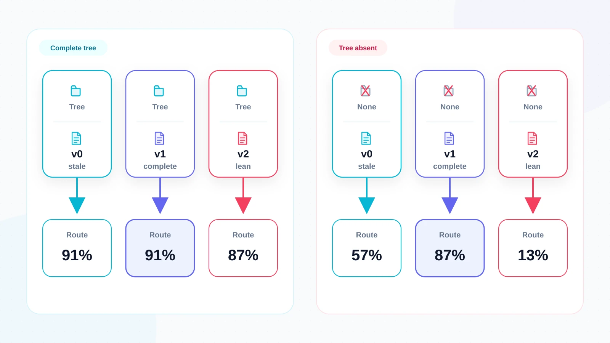
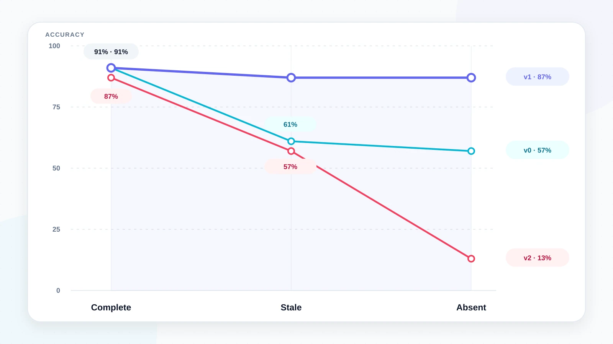
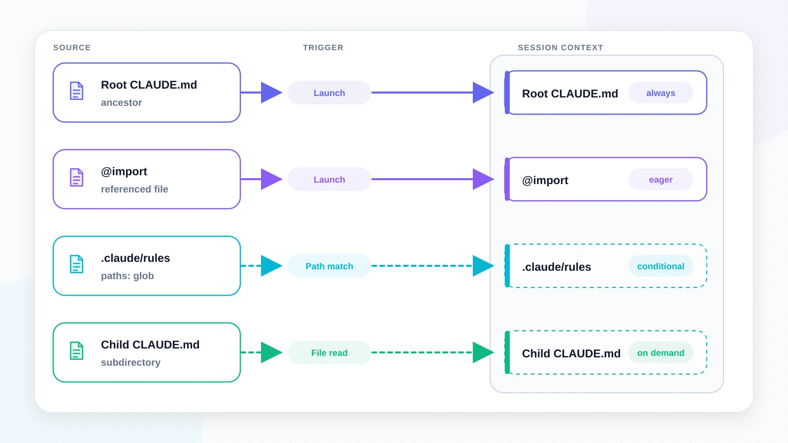
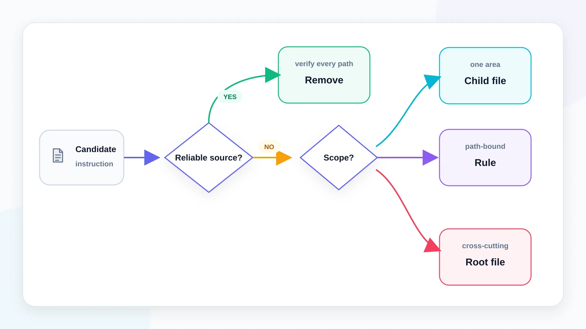
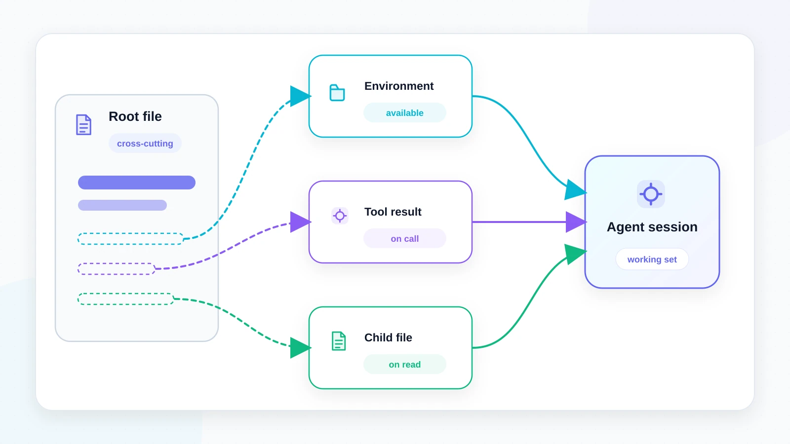

*9 min read. 729 blind trials across 13 experiments, every one an isolated agent
with no conversation history and no knowledge it was being tested.*

---

In July, Boris Cherny sat down at Y Combinator's Startup School. He built Claude
Code. He said something that stuck with me:

> "Every model is very different. So something that you did for one model maybe
> three months ago, it just might not translate at all to the next model."

He was explaining why his team deleted **over 80% of Claude Code's system prompt**
when they moved to Opus 5. He also gave the rule for putting anything back: only
when you see it repeatedly stumble on the same thing, and not too early.

I had a reason to take that personally. In April I read two Claude Code source
trees side by side, v0.2.8 against v2.1.88. That is 211 files against 1,902, 13
months apart. I wrote up what the delta said about how the team thinks
([Tracing the Minds Behind Claude
Code](/writings/tracing-the-minds-behind-claude-code/)). That
piece was archaeology: infer what people believe from what they refuse to change.
This one tests one of those beliefs against my own files.

I run a personal operations workspace. It holds a Columbia MBA's worth of meeting
notes, club logistics, coursework and immigration paperwork. A CLAUDE.md and 10
skills hold it together, 1,100 lines accreted over months. Boris's claim implied
most of it was dead weight.

So I measured. It took four passes to get an answer I trust. The last two were the
ones worth having.

---

## The setup

My workspace comes with free labels. 299 meeting notes, already filed by hand into
25 folders. The folder a note sits in *is* the answer a human gave.

The skill under test routes a meeting to its folder using a table of title
keywords. I built three versions. **v0** is the table as it shipped for months:
668 tokens, 7 course folders it never mentions, a wrong path, 3 rows made
unreachable by row order. **v1** is the same table repaired, 47% larger. **v2** is
a lean rewrite with no table at all, 52% smaller. Four lines: file it where it
belongs, judge from content, use only paths that exist.

23 meetings per arm. Each one ran as an isolated agent seeing a single meeting and
a single version, with no conversation history and no knowledge it was a test.

## Pass one: nothing happened

| | v0 | v1 | v2 lean |
|---|---|---|---|
| accuracy | **91%** | **91%** | **87%** |

Three versions, one of them missing 7 whole categories, all in the same place. My
repair bought nothing. The obvious read is that the table is decoration. Delete it.

I nearly stopped there.

## Pass two: everything happened

A loose thread. How did v0 route `[NNDL] Lecture 14` into `Coursework/NNDL/` when
its table has never contained the string "NNDL"?

Because I'd handed the agent a directory listing along with the task. That's what
the real skill does. It globs the folder before filing. **The model wasn't using
the table. It was reading the filesystem.**

*Figure 1. A healthy directory tree can make stale, repaired, and lean
instructions look equally capable. Remove it and the underlying dependency
appears.*

Same experiment, listing removed: 57% / 87% / **13%**. The lean version collapsed.
It couldn't even produce valid paths, because it had never been told what the paths
were. Meanwhile the repair I'd written off was suddenly worth 30 points.

## Pass three: environments don't vanish, they go stale

Tree-or-no-tree isn't how anything actually fails. Real environments fall behind.
So I built a *stale* listing with 7 of 27 directories missing. They're the same 7
the old table never named, so document and environment are out of date together.

| tree state | v0 stale doc | v1 complete doc | v2 lean doc |
|---|---|---|---|
| complete | 91% | **91%** | 87% |
| **stale** | 61% | **87%** | 57% |
| absent | 57% | **87%** | 13% |

*Figure 2. The complete document holds performance flat as the environment
degrades. Stale and lean documents do not.*

**The complete version is flat in every environment.** That reframes what the extra
tokens are for. They don't buy a better number on a good day. On a good day all
three are identical. They buy the *same* number on a bad day.

> Verbose documentation buys **invariance**, not accuracy.

I caught the mechanism in the act. Six trials wrote a directory path that wasn't in
the listing they'd been shown. All six were in the complete-document arm, and
**all six were correct**. The document overrode a stale environment, which is
precisely its job.

There's a nastier detail in that middle row. When the document is *also* stale it
scores 61%. That's barely better than having no environment at all. Being partially
up to date is close to worthless. The model trusts the list and stops looking.
That's the state every list decays into.

## The prediction I made, then tested

If leanness works by delegating to the environment, it has to fail where the
environment can't answer. So I picked a task where it can't: writing the note
itself. The XML tag structure is pure convention. Nothing derives it.

Full template: **23/23**. Lean template: **0/23**. Not one.

Fair caveat. The lean template says "match the conventions used elsewhere in this
workspace," and my harness forbade reading the workspace. So this measures lean
*plus a withheld environment*. That's the point. A bet on the environment doesn't
degrade when it loses. It goes to zero.

## Pass four: I'd been treating CLAUDE.md as one file

It isn't. Claude Code loads several, on different schedules. An **ancestor**
CLAUDE.md loads at launch, and every session beneath it pays. A **subdirectory**
one loads *on demand*, only when Claude actually reads files there. `@path` imports
load eagerly, so an import costs exactly what inlining costs. `.claude/rules/` with
a `paths:` glob loads on demand too.

*Figure 3. Instruction placement changes when context is paid. Root files and
imports are eager. Rules and child files load only when their scope is touched.*

This is the same shape I found in their source in April. Claude Code splits its
*own* system prompt at a marker called `SYSTEM_PROMPT_DYNAMIC_BOUNDARY`. Everything
before it is cached globally across every user. Everything after is
session-specific. It also stopped inlining 40+ tool schemas in favour of a search
tool that fetches them on demand. The team that deleted 80% of the prompt had
already spent years engineering *where the rest of it loads*. Context is not a
storage problem. It's an economics problem. The question was never how much you
wrote. It's who pays for it.

So *where* a fact lives is a separate decision from whether it should exist, with
its own failure modes. Three arrangements of identical facts:

| | capability | scope leak | ctx tokens |
|---|---|---|---|
| everything at root | 21/21 | **6/6 leaked** | 345 |
| **stratified** | **21/21** | **0/6** | **221 (−36%)** |
| misplaced (inverted) | 18/21 | 6/6 | 256 |

Stratification is free on capability. But the column that stopped me was the middle
one.

**Everything-at-root leaked, 6 times out of 6.** A session working on club
logistics answered the immigration approval rate and named my tax preparer. That's
not a correctness failure. The flat arrangement scored 100%. It's a *scope*
failure. Every session gets facts it has no business holding. In a workspace
carrying immigration status and tax detail, that's a better argument for
restructuring than tokens will ever be.

Then the obvious objection. What does pushing a fact down actually cost? Every task
above was asked from *inside* the relevant sub-project, the case stratification is
built for. So I asked from the root instead, with no sub-project file opened.

**0 of 12 answered.** The fact is simply gone.

But **12 of 12 said so**. Several named the fix: *"I would need to open the
sub-project files to answer."* None fabricated.

> Placement trades a **certain, silent** cost against an **occasional, loud** one.
> A narrow fact at root costs every session tokens and leaks scope every time,
> quietly. Pushed down, it costs root-level queries every time, loudly and
> recoverably.

*Figure 4. Root placement spends tokens and leaks scope in every session.
Stratification confines the fact and turns a miss into a visible, recoverable
event.*

A loud failure gets fixed inside the same session. The agent reads a file in that
directory, the child CLAUDE.md loads, the answer arrives. A silent wrong answer
doesn't.

## Two smaller checks

**Does this depend on the model?** I ran the same trials on Sonnet 5 and Haiku 4.5.
The complete document scored **21/23 on all three**, identical. The lean one
declined monotonically: 20, 19, 18. That's directional, not proven at this sample
size (p = 0.13). It's the same structure as the environment finding, with model
capability substituted in.

**Does thinking harder rescue leanness?** I predicted it would. **Wrong.** 91/91/91
for verbose and 87/87/87 for lean at low, medium and high effort. Identical, case
for case. The same two cases fail every time, and they turn out to be genuine label
ambiguity in my own filing.

## Anthropic published the rules while I was measuring them

A week before that talk, Anthropic published the long version: [six new rules of
context engineering for Claude 5
models](https://claude.com/blog/the-new-rules-of-context-engineering-for-claude-5-generation-models).
I found it after the experiments were finished, which is what makes the overlap
worth anything.

Their sharpest practical instruction:

> "Avoid stating 'the obvious' things Claude should know by looking at your file
> system or your repo."

Without having read that sentence, I had built an experiment on it. On a healthy
repo it is exactly right. 91, 91, 87. Three documents, one of them missing 7 whole
categories, indistinguishable. The condition is the other two rows of that table.
The lean version loses **74 points** when the file system stops answering, and
stale is barely better than absent.

Three more places we line up, and one I'd push on.

**"Let Claude use judgement."** This was the biggest single effect I measured, 26%
to 91%. But it only works where the model has something to judge *against*. On a
format convention: 0/3. On a policy: 0/3. There, given explicit permission to
override, it invented a justification for a constraint I had made up for the trial.

**"Consider having a tree of files that can be loaded at the right time."** That's
stratification, and it's free on capability at 36% fewer tokens. They argue it on
context cost. The stronger argument is the one they don't make: 6/6 versus 0/6 on
scope leak.

**"No measurable loss on our coding evaluations."** I believe it. Coding evals run
against real repositories, which is precisely the healthy environment where the
advice holds. It's also the claim I'd most want a sample size on. My own first pass
showed no measurable loss either, right up until I noticed my harness was handing
the agent a directory listing.

Three of their six rules I can't speak to at all: examples versus interfaces, tool
descriptions, auto-memory. No arms, no data. Worth saying out loud rather than
implying coverage I don't have.

> They published the rules. What I have is the conditions under which they hold.
> The healthy-environment case, where the rules are most obviously right, is the
> one case where the difference is invisible.

## What I'd actually tell you

**Decide leanness against the worst environment you'll run in, not the typical
one.** All three versions look equivalent on a healthy day. That's the trap.

**For every deletion, name what supplies the fact instead.** A glob, a tool result,
a file that's always read. Then check it fires on every path in. If you can't name
it, you're removing the only copy.

**Classify before you cut.** Procedure is often deletable. Convention, policy and
plain facts aren't. Stripping project context entirely dropped task success to 2/9.

**Place a fact where it's used, not where it's convenient.** Only needed while
working in one area? Put it in that subdirectory. Narrow but reachable from
anywhere? `.claude/rules/` with a `paths:` glob, which is demand-loaded. Genuinely
cross-cutting? Root.

*Figure 5. Delete only when a reliable source supplies the fact on every path.
Otherwise keep it at the narrowest scope that still loads when needed.*

**Add a judgment clause to anything checkable.** *"Where the instruction and the
actual content disagree, use your judgment."* Against a corrupted table it moved
accuracy from 26% to 91% (p = 0.00001). Against a correct one it cost nothing. It
does nothing for conventions or policies, where there's no evidence to override
from.

**Run the boring checks first.** Five real defects turned up across two skills and
the root CLAUDE.md: missing routes, a wrong path, unreachable rows, a partial
enumeration covering 4 of 25 directories, and a dangling pointer to a directory
that doesn't exist. *None* came from the 624 trials I ran against those same files.
They came from reading them. `/doctor` will tell you what actually loaded. Nothing
tells you whether what loaded is true, so I wrote that reading down as a script
(`audit_agent_docs.py`). It found more than the entire experiment programme.

## Limits

23 cases per arm on the content work, and 105 trials on placement using synthetic
arrangements rather than my live files. The minimum difference this design can
detect is 25 points. The portability gradient is directional, not established. The
36% token saving is specific to my ratio of global to narrow content and should be
re-measured, not quoted.

An early version of this reported a much stronger result. Then I noticed my own
evaluation prompt was instructing the model to follow instructions, and then
scoring it for following instructions. Removing that wrapper moved one arm from 0/3
to 2/3. Half the original headline was my prompt.

What survives is two shapes. **The lean document scored 87% and 13% depending on
nothing but the environment handed to the agent, and the complete one never fell
below 87% no matter what I did to it.** And **the same facts, moved between files,
changed nothing about what the agent could do and everything about what it knew
that it shouldn't.**

Boris was right that most of the prompt can go. What I'd add is that the 80% you
delete doesn't vanish. It moves, into the environment or into a file one level
down. It's only gone for as long as whatever now holds it keeps holding it up.

*Figure 6. Deleting an instruction does not erase its responsibility. It transfers
it to an environment, tool result, or lower-level file that must remain available.*
