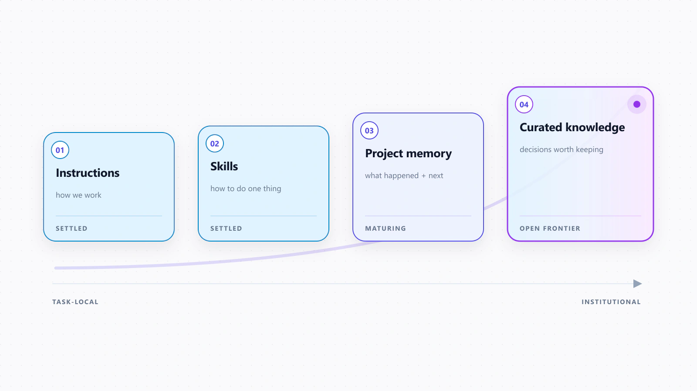
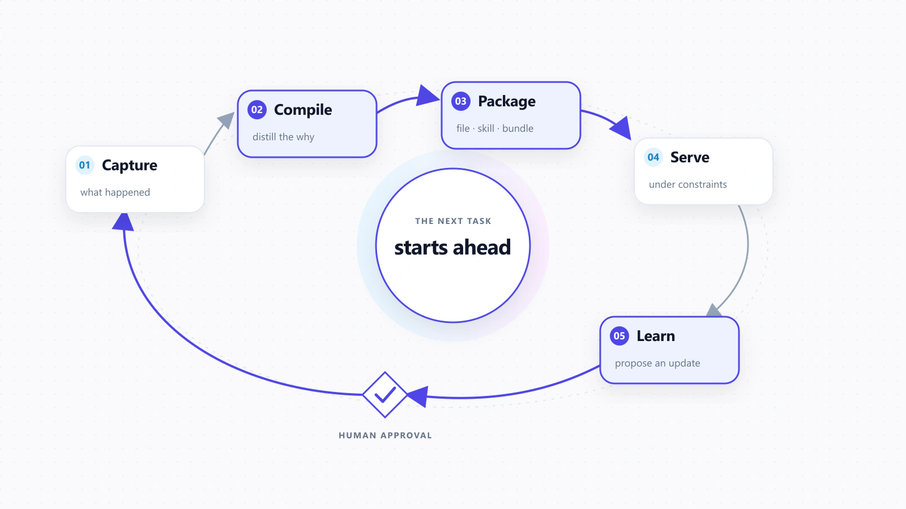
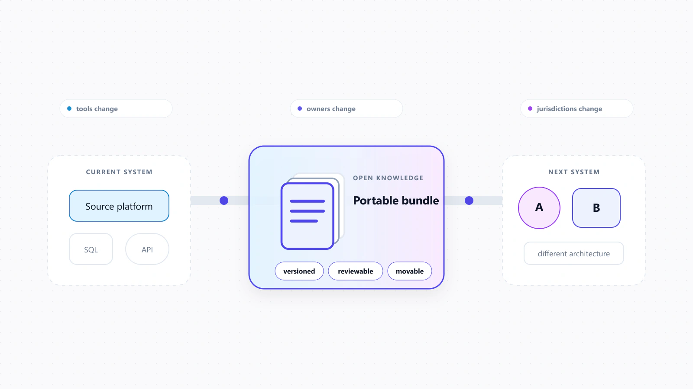
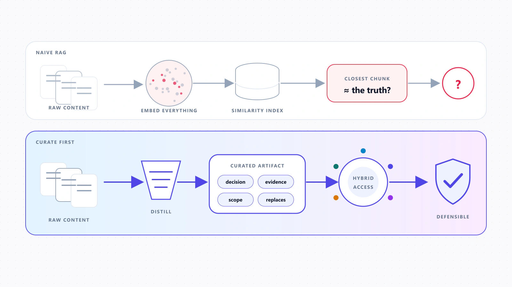
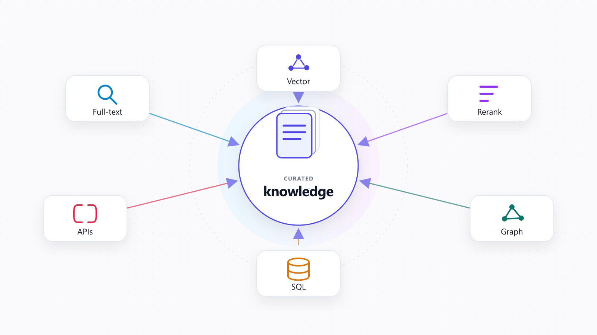
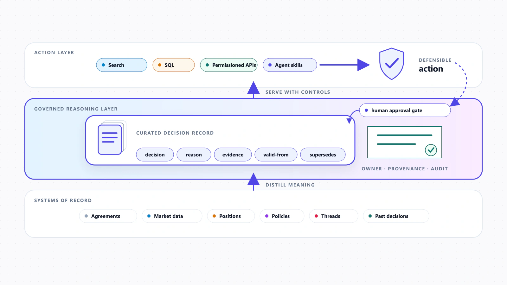

My last essay argued that finance spent two decades standardizing its *data* and almost nothing standardizing its *knowledge*. The reasoning behind decisions, the embedded *why*, lives in threads and people's heads and never gets filed. I said that reasoning is the real asset and the real moat.

I left a question open. A few readers asked it back to me: fine, but what is that asset supposed to look like in a system? Once you decide to keep the *why*, where does it actually live?

I didn't have a clean answer then. I do now. It didn't come from finance. It came from watching the teams building the most advanced AI systems in the world land on the same answer, without coordinating.

It also came from building. I've spent ~50 hours assembling my own agentic OS around the [Hermes Agent](https://hermes-agent.ai/) and [Obsidian](https://obsidian.md), and a lot has changed along the way. The parts that stuck were never the clever prompts. They were the files: notes, instructions, and decisions I could read, edit, and hand to an agent. Watching my own setup converge on the same shape as the frontier's is part of why I trust the pattern.

## The frontier externalized its memory

Andrej Karpathy described the pattern before it had a name. Instead of re-deriving the same explanation every time, you write down what you know once, in a [navigable wiki](https://gist.github.com/karpathy/442a6bf555914893e9891c11519de94f), and read from it after that. Compile once, retrieve many times. That is a knowledge-management idea, not a coding trick. Over the past year it has become the default way frontier agents work.

Look at what shipped. Anthropic's [Agent Skills](https://platform.claude.com/docs/en/agents-and-tools/agent-skills/overview) package expertise as "reusable, filesystem-based resources." A skill is a folder with a Markdown file, and the agent loads it only when the task calls for it. OpenAI runs long tasks in Codex the same way. It calls the single most important technique "[durable project memory](https://developers.openai.com/blog/run-long-horizon-tasks-with-codex)," and it is a handful of Markdown files: a spec, a plan, a runbook, a running log of decisions. [Anthropic's guidance for long-running agents](https://www.anthropic.com/engineering/effective-harnesses-for-long-running-agents) leans on the same trick, a progress file plus git history, because "each new session begins with no memory of what came before." A convention called [`AGENTS.md`](https://agents.md/) is now read by rival products that agree on almost nothing else.

None of these teams set out to build a knowledge base. Each was solving a smaller problem. How do you keep an agent coherent across a long task? How do you stop re-explaining the same conventions? Each reached for the same shape: **durable knowledge, written to files you can read, maintained like code.**

One caution, because "memory" has gotten slippery. Four different things are converging, and they are not the same. There are *instructions* (how we work), *skills* (how to do one specific thing), *project memory* (what happened and what's next), and *curated knowledge* (the decisions worth keeping). Instructions and skills are largely settled now. Project memory is getting there. Curated knowledge, the part finance cares about, is the least settled and the most valuable. That should feel familiar. It is the same inversion from the first essay, where the highest-value tier was the one nobody captured.

Instructions and skills are largely settled; curated knowledge remains the least-settled and highest-value layer.

## From files to a knowledge supply chain

The question isn't files versus databases. Think of it as a supply chain with five steps. Most firms only run two of them.

**Capture** what happened: decisions, rationale, corrections, the answers that turned out right. **Compile** that raw exhaust into something reusable. Not the transcript, but the decision, the reason, the evidence, when it applies, and what it replaces. **Package** it in a form that fits, whether that's an instruction file, a skill, a Markdown bundle, or a semantic model. **Serve** it under real constraints. Then **learn**: push what worked back into the base so the next task starts ahead.

Capture, compile, package, serve, and learn—closed by human approval so the next task starts ahead.

Manus is the cleanest example I've seen of that whole loop running end to end, which is part of why I've watched it closely as a Manus Fellow. It treats the filesystem as, in its engineers' words, "[the ultimate context](https://manus.im/blog/Context-Engineering-for-AI-Agents-Lessons-from-Building-Manus)," a memory the agent reads and writes as it goes. Its Projects hold instructions and reference files across sessions, so work starts warm instead of cold. It adopted the open Agent Skills standard instead of building a closed one. And it added a step most systems skip. After a task, the agent can spot a reusable decision and *propose* an update to the project's instructions or files. The change only lands after a person approves it.

That approval step is the part finance people should notice. It is the discipline the first essay was reaching for. Capture falls out of the work, but nothing enters the shared record until an accountable person signs off. The agent proposes. A person decides what becomes institutional knowledge.

## OKF and the portability bet

If knowledge is going to be an asset, it needs a form that outlives the tool that made it. That is the bet behind [Google's Open Knowledge Format](https://cloud.google.com/blog/products/data-analytics/how-the-open-knowledge-format-can-improve-data-sharing/). OKF is not a database, a serving stack, or a query engine, and it doesn't try to be. It is a portable format for knowledge. You write curated knowledge down once, and it can move between systems, get inspected, and sit under version control.

Finance already made this move for data. Platforms like [Fusion](https://fusion.jpmorgan.com) took custody, accounting, and vendor feeds and folded them into one common model so the data could travel. OKF proposes the same thing for knowledge: the common model, not the warehouse. There's an early sign it's more than a spec. LangChain's [OpenWiki](https://www.langchain.com/blog/openwiki-0-2-adds-okf-support), an unrelated tool, adopted OKF within weeks. A knowledge bundle can already outlive any one vendor's product. Tools, owners, and jurisdictions change faster than anyone would like. Knowledge you can pick up and move isn't a nice-to-have. It's risk management.

A versioned knowledge bundle can outlive the tool, owner, or jurisdiction around it.

## RAG is not dead. It has a smaller job.

The quick objection is that this kills retrieval. If the knowledge is curated into files, who needs RAG? The production evidence says otherwise.

What's dying is *naive* RAG: embed every chunk of every document into a vector store and pray that similarity search finds the truth. What's replacing it is hybrid retrieval: full-text and vector search, metadata filters, reranking, graphs, SQL, and APIs, all running over knowledge that was curated *first*. Cerebras is blunt about the order of operations for [its own knowledge base](https://www.cerebras.ai/blog/how-we-built-our-knowledge-base): distill before you embed. The file is the real artifact. The index is just a way in. You keep both. You stop asking the index to invent knowledge at query time.

Distill the decision, evidence, scope, and supersession first; let retrieval find it afterward.

So the honest answer to "is RAG dead?" is no. It got demoted. Retrieval used to be the whole knowledge system. Now it's one service, and curated knowledge sits at the center.

Full-text, vector, reranking, graph, SQL, and API access paths all point inward to the curated artifact.

## Enterprise scale still needs a curated layer

The other objection is scale. This is fine for a coding project, but surely it breaks against a real enterprise corpus. The best counterexample runs the other way.

Spotify has one of the largest data estates in the industry, tens of thousands of datasets. When it [built a data assistant](https://engineering.atspotify.com/2026/6/encoding-your-domain-expert-the-context-layer-behind-spotifys-data-assistant), the tempting path was to let the system learn context on its own from the full history of past queries. It looked scalable. It didn't work. The judgment that made an answer correct still had to be written down by domain experts. So Spotify curates context by hand. Datasets come bundled with vetted question-and-SQL pairs and business meaning, and retrieval runs on top of that. Snowflake's Cortex Analyst does the same with semantic models and a [repository of human-verified queries](https://docs.snowflake.com/en/user-guide/snowflake-cortex/cortex-analyst/verified-query-repository). [Databricks Genie](https://docs.databricks.com/aws/en/genie/best-practices) curates instructions, examples, and business definitions in a knowledge store. Different storage. Same conclusion.

That changes the usual adoption story. It isn't just startups moving fast while enterprises lag. Spotify, Snowflake, Databricks, and Morgan Stanley are not startups, and Morgan Stanley says [nearly all of its advisor teams use its assistant](https://openai.com/index/morgan-stanley/). The real split is different. Some firms treat their knowledge as raw content to search. Others treat it as context to curate, check, and govern before anyone retrieves it. Plenty of firms have adopted AI. The gap that matters is production maturity, and it moves with how sensitive the data is and how much a wrong answer costs.

## What this looks like in finance

Translate the layer, not the file format. The knowledge worth curating in a firm is the *why* from the first essay. The decision behind a deal and the reasoning that produced it. The credit exception and why it was granted. The research view stamped with a valid-from date, and the note that replaces it. The post-mortem linked back to the assumption it broke. The approved reading of an ambiguous policy. Recurring diligence and investment-committee workflows become skills. Operating instructions, entitlements, and audit requirements become part of the same governed record.

The raw material stays where it belongs. The agreements, the market data, the positions live in systems built to hold them, reached through search, SQL, and permission-aware APIs. The knowledge layer doesn't replace any of that. It keeps what those facts *meant* to the firm at the time, in a form a person can review and an agent can act on.

Which brings me back to how the first essay ended, and the line I keep returning to. The deliverable was never retrieval. It's a defensible action that a specific, accountable person, or now a specific agent, can stand behind.

Facts stay in systems of record; governed reasoning becomes the layer that supports a defensible action.

## The next golden source

Finance got golden sources for its data because regulation forced the issue, and the industry is better for it. Knowledge never got the same treatment. No authoritative tier, no supersession, no provenance, no owner. The frontier has now shown what that maintained layer looks like, and that it holds up at scale. The moat was never the file format or the retrieval engine. It's the quality, the history, and the trust of the reasoning a firm decides to keep.

---

*This is the follow-up to [How I Think About Knowledge in Finance](/writings/knowledge-for-finance), where I argued the reasoning behind decisions is the real moat. Start there if you're new to the argument.*
