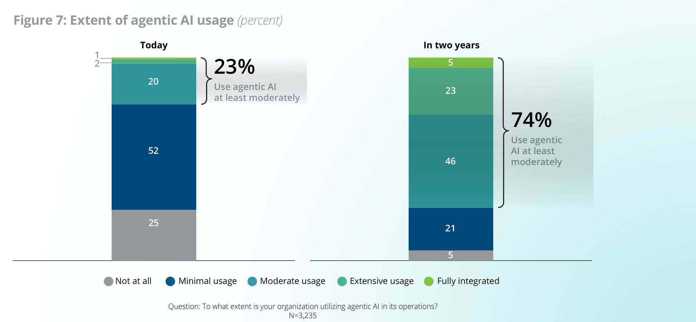
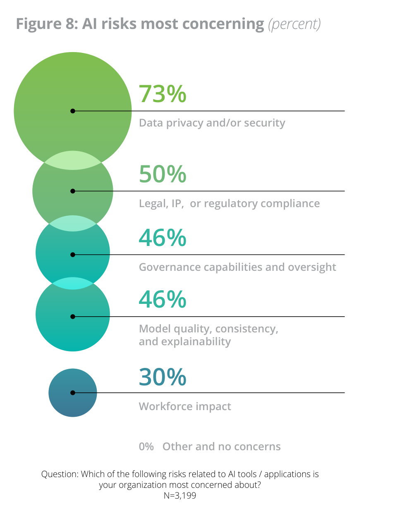
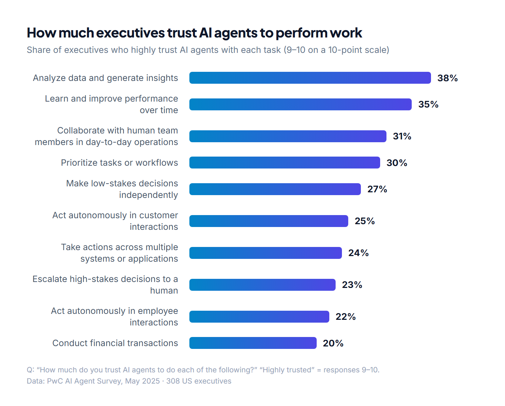

Today I guest-lectured at Columbia Business School's executive education program, [The Business of AI](https://execed.business.columbia.edu/programs/business-ai), alongside [Prof. Moran Cerf](https://business.columbia.edu/staff/people/moran-cerf). The room was filled with Directors, VPs, and C-suite leaders from global firms: people with decades of experience running businesses, managing risk, and making high-stakes decisions long before AI entered the conversation.

After a morning of AI fundamentals — how LLMs work, fine-tuning, RAG, and open-weight models — I ran a live demo: building a **full DCF valuation model and a board-ready pitch deck** using Claude's Excel and PowerPoint integration, from a blank spreadsheet to finished deliverables in **under 15 minutes**.

What followed was the most valuable part of the session for me. The Q&A surfaced questions that I don't typically hear in tech-native circles: questions shaped by real operational complexity, regulatory constraints, and fiduciary responsibility. These leaders weren't asking *whether* AI works. They were pressure-testing *how it fits* into the world they already navigate.

Here are the questions they raised, reframed with context and data I've gathered since.

---

## 1. "If AI builds the model, who's liable when it's wrong?"

This was the first question out of the room: before any demo, before any use case. **Liability.**

The short answer: **the institution is.** AI providers explicitly disclaim liability for outputs. When Claude builds a DCF or drafts a loan approval, the firm's name is on it. The model provider's isn't.

As several people in the room pointed out, this isn't entirely new. It's the same principle that applies when a first-year analyst builds a model: the MD who signs off owns the output. AI doesn't change the accountability chain. It changes the speed at which errors can propagate if no one's checking.

The data supports the urgency. [McKinsey's 2025 State of AI report](https://www.mckinsey.com/capabilities/quantumblack/our-insights/the-state-of-ai) found that **51% of firms using AI have already seen at least one negative consequence**, yet accountability remains diffuse:

| Who takes responsibility for AI governance? | % of firms |
|---|---|
| CEO directly responsible | **28%** |
| Board directly responsible | **17%** |
| Mature governance model for autonomous AI agents | **21%** |

*Sources: [McKinsey 2025](https://www.mckinsey.com/capabilities/quantumblack/our-insights/the-state-of-ai-how-organizations-are-rewiring-to-capture-value) (CEO and board figures), [Deloitte 2026 State of AI in the Enterprise](https://www.deloitte.com/us/en/what-we-do/capabilities/applied-artificial-intelligence/content/state-of-ai-in-the-enterprise.html) (agent governance figure)*

Meanwhile, **74% of organizations** expect to be using AI agents at least moderately by 2027 (Deloitte). The gap between adoption velocity and governance readiness is where risk lives.

Agentic AI usage today vs. expected in two years. Source: <a href="https://www.deloitte.com/content/dam/assets-zone3/us/en/docs/services/consulting/2026/state-of-ai-2026.pdf" target="_blank" rel="noopener">Deloitte, State of AI in the Enterprise, 9th edition (2026)</a>, Figure 7.

> **The real question isn't "can AI make mistakes?"** It's whether existing review processes catch mistakes regardless of who — or what — made them. If QA relies on the assumption that a human built the model slowly, that's a process gap, not an AI problem.

## 2. "We'd have to give them everything — all our documents, all our IP. How safe is that?"

This question carried real weight in the room. You could feel the tension. These are leaders whose firms spend **millions on information barriers and data classification**. They live this risk daily.

Prof. Cerf made a point that resonated: your documents are already sitting on someone else's cloud (AWS, Azure, Google Cloud). The migration to cloud infrastructure was the decision point. Fine-tuning is a flag you turn on within infrastructure you've already entrusted.

That said, the concern isn't irrational, and the executives in the room were right to push on it. There's a meaningful difference between the two:

| | Cloud Storage | Fine-Tuning |
|---|---|---|
| **What happens to your data** | Stored in a vault, encrypted at rest | Fed into a learning process |
| **Who accesses it** | Only your authorized users | Model training pipeline |
| **Contractual protection** | Standard data processing agreements | Provider commits to not training general models on your data |
| **Perceived risk** | Well-understood | High; the **AI risk executives cite most** |

[PwC's 2025 Responsible AI Survey](https://www.pwc.com/us/en/tech-effect/ai-analytics/responsible-ai-survey.html) found that **only one-third of CEOs globally** have high trust in embedding AI into key processes. [Deloitte](https://www.deloitte.com/us/en/what-we-do/capabilities/applied-artificial-intelligence/content/state-of-ai-in-the-enterprise.html) reports that **73% of executives** rank data privacy and security as the AI risk that worries them most.

The AI risks executives cite most. Source: <a href="https://www.deloitte.com/content/dam/assets-zone3/us/en/docs/services/consulting/2026/state-of-ai-2026.pdf" target="_blank" rel="noopener">Deloitte, State of AI in the Enterprise, 9th edition (2026)</a>, Figure 8.

> What I've observed from firms that move quickly on this: they reframe it from "is it safe?" to **"what data classification does this require, and what's the deployment model that matches our existing governance?"** That turns a philosophical debate into a procurement decision.

## 3. "What are the switching costs if we pick the wrong provider?"

This is a **CFO question disguised as a technology question**, and it's a sharp one. What they're really asking: if we bet on one AI provider and they raise prices, get acquired, or fall behind, are we locked in?

The current landscape is surprisingly encouraging on this front. AI companies have deliberately made switching easy. APIs are largely interoperable. A RAG implementation built for Claude can be ported to GPT or Gemini with minimal code changes. The providers are competing for enterprise deals by lowering switching costs, not raising them.

The major banks are already designing for exactly this scenario:

| Bank | Platform | Architecture |
|---|---|---|
| **JPMorgan** | [LLM Suite](https://www.jpmorganchase.com/about/technology/news/llmsuite-ab-award), American Banker's 2025 Innovation of the Year | **250,000 employees** with access; integrates OpenAI + Anthropic models; updates every **8 weeks** ([CNBC](https://www.cnbc.com/2025/09/30/jpmorgan-chase-fully-ai-connected-megabank.html)) |
| **Goldman Sachs** | [GS AI Assistant](https://www.americanbanker.com/news/goldman-sachs-staff-now-write-a-million-gen-ai-prompts-a-month) | Routes to **GPT, Gemini, or Claude** depending on the task |
| **Citigroup** | [Citi AI tools](https://fortune.com/2025/04/09/how-citis-cto-is-rolling-out-new-gen-ai-productivity-tools-to-more-employees-across-the-globe/) | Multi-model rollout reaching **150,000 employees** globally |

They've all designed around the same assumption: **no single provider stays on top forever.**

But there's a subtlety that one executive in the room flagged: the switching cost isn't in the API. It's in the **institutional knowledge** encoded in the system: prompt libraries, fine-tuned models, learned workflows. The deeper the integration, the more the switching cost becomes a people problem, not a technology problem.

## 4. "How do you actually verify the output?"

This was the question the room kept returning to, and rightly so. Not "can AI do the work?" They'd just watched it build a complete valuation model. The question was: **"should I trust it?"**

[PwC](https://www.pwc.com/us/en/tech-effect/ai-analytics/ai-agent-survey.html) measured executives' trust in AI agents by task:

Executive trust in AI agents, by task. Data: <a href="https://www.pwc.com/us/en/tech-effect/ai-analytics/ai-agent-survey.html" target="_blank" rel="noopener">PwC AI Agent Survey (2025)</a>; chart by the author.

The gap between capability and confidence is where most enterprises stall. Three approaches came up in the discussion, and the most sophisticated teams seem to use all of them:

### 1. Use your existing templates

Rather than starting from a blank canvas, feed the AI your firm's existing model template, the same one analysts use. The AI populates it; the reviewer checks it against a structure they already understand. **The verification surface area shrinks.**

### 2. Check the work in stages, not at the end

The same way you'd review an analyst's work: **assumptions → build → output**. No tool — human or AI — should run unsupervised from prompt to final deliverable.

### 3. Use a second model to audit the first

One executive in the room shared this practice: have a different LLM write the test cases and validation checks, then run those against the original output. It's the **AI equivalent of a four-eyes review**.

> **The deeper point:** Verification isn't an AI-specific problem. It's a workflow design problem. If your current process can't catch a wrong number regardless of who put it there, AI didn't create the risk. It exposed it.

## 5. "If we sell the business and we've fine-tuned a model with all our data, does that hit the multiple?"

This one surprised me. It's a question I wouldn't have thought to ask, and it reveals how deeply these leaders think about **AI as a balance sheet issue**, not just an operations issue.

The concern has two dimensions:

**Valuation risk:** If your proprietary data lives inside a third-party's fine-tuned model, is that an **asset** or a **dependency**? It's not on your balance sheet, you don't own the weights, and the provider can change terms. A buyer doing diligence will ask about it.

**Durability risk:** If your competitive advantage is encoded in a system you rent, how does an acquirer evaluate how long that advantage lasts?

There isn't a settled answer yet; this is genuinely uncharted territory. But the direction is suggestive. [NVIDIA's 2026 State of AI in Financial Services survey](https://blogs.nvidia.com/blog/ai-in-financial-services-survey-2026/) found that **83% of financial services firms** say open-source models are important to their AI strategy. The firms moving toward **open-weight models and on-premise deployments** are partly doing so because ownership of the model is cleaner from a corporate finance perspective.

> If you're building toward an exit or a strategic transaction, **how you deploy AI today has implications for how your business gets valued tomorrow.**

## 6. "Will investment banks stop hiring junior analysts?"

A senior executive posed this not as a fear, but as a hypothesis, and then answered it himself: *"Seems to me the analyst jobs aren't going anywhere. They'll be doing more sophisticated work."*

I think he's largely right, and the data supports his instinct. The volume of pure production work — building models from scratch, formatting pitch books, pulling comps — will compress. That's the work that kept analysts in the office until 4 AM, and it's the work AI handles well today.

But the signals are contradictory:

| What the headlines say | What actually happened |
|---|---|
| Some firms considered cutting junior hiring by **as much as two-thirds** ([Fortune](https://fortune.com/2025/06/02/junior-analysts-wall-street-jobs-taken-by-ai/)) | Goldman **added ~1,800** and JPMorgan **added ~2,000** employees in 2025 ([Fortune](https://fortune.com/2025/12/21/is-ai-killing-finance-and-banking-jobs-experts-say-wall-street-layoffs-hype-than-takeover/)) |
| OpenAI's ["Project Mercury"](https://fortune.com/2025/10/22/sam-altman-openai-wall-street-junior-bankers-ai-entry-level-jobs/) enlisted **100+ ex-investment bankers** to train its financial-modeling AI | Actual headcounts at major banks **rose** in 2025 |

The real shift isn't fewer analysts. It's **analysts who arrive at judgment faster**. A first-year who can build and review an AI-generated model in **2 hours** instead of building one from scratch in **12** has ten extra hours to spend on second-year work: client interaction, sector expertise, deal strategy.

> From where I sit, watching how the fastest-moving teams actually use these tools, **the firms that treat AI as a headcount reduction tool will struggle to retain talent.** The firms that treat it as a leverage multiplier — more output per person, higher-quality thinking earlier in careers — seem better positioned for the long game.

## 7. "What kind of person should we be hiring for this world?"

This was the question with **the most energy in the room**, and it's one where their experience matters far more than mine. I can speak to what the tools can do. They know what it takes to change how **thousands of people** work.

[BCG's "AI at Work 2025" survey](https://www.bcg.com/publications/2025/ai-at-work-momentum-builds-but-gaps-remain) found:

- Only **36%** of employees say they've received enough training to use AI
- Only **25%** of frontline workers report strong support from leadership
- But employee positivity about AI **rises from 15% to 55%** with strong leadership support

[McKinsey's "Superagency in the Workplace" report](https://www.mckinsey.com/capabilities/tech-and-ai/our-insights/superagency-in-the-workplace-empowering-people-to-unlock-ais-full-potential-at-work) found that employees are **3x more likely** than leaders expect to already be using gen AI for 30%+ of their daily work, yet **47% of C-suite leaders** say their companies are developing AI tools too slowly, citing talent gaps and resourcing constraints.

From the AI side, three qualities seem to matter more now than they did two years ago, though I suspect anyone who's led a major technology transition would recognize the pattern:

### Learning velocity over domain depth

The toolset changes every quarter. Domain expertise still matters, but it's table stakes. **The differentiator is how fast someone absorbs and applies new capabilities.**

### Judgment under ambiguity

When AI generates a model, someone needs to decide: is this output good enough? Does this assumption hold for our client's industry? That's not a technical skill. It's a combination of **business acumen, pattern recognition, and intellectual honesty**.

### Comfort engaging with the machine's reasoning

Not just using AI, but interrogating it: reading the thinking trace, challenging assumptions, iterating on prompts. The analysts who treat AI as a black box will produce mediocre work. **The ones who engage with the process will produce exceptional work.**

## 8. "How does Claude compare to Microsoft Copilot?"

Every executive audience asks this. It's the vendor selection question, and it matters because most firms will standardize on one or two platforms.

I work extensively with Claude, so I'll be transparent about my bias. Rather than a specific comparison that will be outdated in months, here's the **evaluation framework** I think holds up:

| Evaluation dimension | What to ask | Why it matters |
|---|---|---|
| **Workflow fit** | Where does the AI need to operate? | M365-heavy → Copilot advantage. Developer tooling → Claude Code leads. Complex reasoning → Claude's extended thinking is differentiated. |
| **Integration depth** | Surface-level or cross-application? | Chatbots and summarizers are interchangeable. AI that reads your Excel model and writes your PowerPoint deck in one workflow creates genuine leverage. |
| **Enterprise posture** | Data handling, compliance, deployment options? | For regulated industries, this often matters **more than model benchmarks**. |

The major banks aren't picking one. [JPMorgan](https://www.cnbc.com/2025/09/30/jpmorgan-chase-fully-ai-connected-megabank.html), [Goldman Sachs](https://www.ai-street.co/p/goldman-joins-jpm-morgan-stanley-releasing-ai-tool), and [Citigroup](https://fortune.com/2025/04/09/how-citis-cto-is-rolling-out-new-gen-ai-productivity-tools-to-more-employees-across-the-globe/) all run **multi-model architectures**.

> The pattern I see among the firms moving fastest: **don't pick one.** Design workflows to be model-agnostic where possible, and go deep on one platform only where the integration creates real leverage.

## 9. "Can it process real-time market data?"

**Yes.** This is where the capability gap between "AI chatbot" and "AI agent" becomes concrete.

| | AI Chatbot | AI Agent |
|---|---|---|
| **Data source** | Fixed context you provide | Actively searches and retrieves |
| **Market data** | Static — whatever's in the prompt | Dynamic — pulls current rates, filings, benchmarks |
| **Output** | Answers based on what it was given | Synthesizes proprietary context **+ live market conditions** |

When Claude builds a financial model, it doesn't just work from the documents you provide. It can search the web for current market data, pull SEC filings, and cross-reference industry benchmarks. A DCF built on stale assumptions is worse than useless. The ability to **dynamically incorporate today's risk-free rate, current trading multiples, or recent comparable transactions** — without a human manually updating inputs — changes the unit economics of analysis.

[NVIDIA's survey](https://blogs.nvidia.com/blog/ai-in-financial-services-survey-2026/) found that **42% of financial services firms** are already using or assessing agentic AI, with **21% having deployed AI agents**. The shift from static chat to dynamic agents is well underway.

> The caveat: real-time doesn't mean infallible. The AI can pull a wrong number from a misread source just like a human can. **Verification still applies.** But the speed of assembly is the real shift.

## 10. "What should we be preparing for — strategically?"

This was the question underneath many of the tactical ones. Prof. Cerf laid out the three enterprise AI adoption models earlier in the day, and the trend line is clear: **enterprises are moving toward more control.**

| Model | How it works | Data ownership | Best for |
|---|---|---|---|
| **Fine-tuning** | Give your data to the provider; they customize the model | Provider holds the weights | Specialized tasks, smaller firms |
| **RAG** | Keep your data; augment the prompt at query time | You retain full ownership | Most enterprise use cases today |
| **Open weights** | Run the model on your own infrastructure | Complete ownership and control | Regulated industries, M&A-sensitive firms |

The data confirms the trajectory. [NVIDIA](https://blogs.nvidia.com/blog/ai-in-financial-services-survey-2026/) reports that active AI usage in financial services jumped from **45% to 65%** year-over-year, with **83%** citing open-source models as important to strategy. [Goldman Sachs' "OneGS 3.0" memo](https://fortune.com/2025/10/14/goldman-sachs-layoffs-headcount-earnings-ai-efficiencies/) told staff the firm will **constrain headcount growth** and run a "limited reduction in roles" as AI efficiency gains land. JPMorgan, Goldman, and Citi have all deployed AI to over **100,000 employees each**, through model-agnostic platforms rather than locked-in commitments.

[Accenture's AI revenue tripled to **$2.7 billion** in FY2025](https://www.ciodive.com/news/accenture-generative-ai-revenue-skills-training-data-modernization/761161/), with bookings reaching **$5.9 billion**. The company [has since said](https://constellationr.com/blog-news/insights/accenture-says-advanced-ai-so-pervasive-it-won-t-break-it-out-anymore) it will stop breaking out AI revenue entirely because **AI is now embedded across most client engagements**. That's the signal: AI is moving from a line item to an operating assumption.

> The biggest risk probably isn't choosing the wrong model. It's building organizational muscle memory around a single approach and being unable to adapt when the landscape shifts. **Portability in data architecture, prompt libraries, and team AI fluency** seems like the best hedge available right now.

---

## What I Took Away

I walked into this session thinking I'd be teaching. I walked out realizing how much I was learning.

The technology questions — *can it do X, how does it compare to Y* — got answered relatively quickly. The questions that lingered were about **liability, talent, competitive advantage, and organizational design**. Those don't have clean answers yet, and they're the ones that require exactly the kind of judgment and experience that was sitting in that room.

I know the latest developments in AI. These leaders know what it actually takes to change how a **10,000-person organization** operates, how to navigate regulatory constraints across jurisdictions, how to make investment decisions when the technology landscape shifts every quarter. That's a different — and harder — kind of expertise.

---

## Three Questions I'd Ask Back

The best conversations aren't one-directional. If I could sit back down with that room, here's what I'd want to ask them:

### 1. How do you verify what's true when there's too much information to process?

AI hallucination gets all the attention, but senior leaders have been dealing with information overload long before LLMs. When you're getting **conflicting signals** from consultants, internal reports, market data, and board members — each with their own incentives — how do you actually decide what to trust? I suspect the verification frameworks that work for AI outputs are the same ones that already work for everything else. I'd love to know what yours look like.

### 2. What was the last major technology shift your organization resisted — and what did the resistance teach you?

Every firm has a story about a technology they adopted too late or too early. Cloud migration, electronic trading, mobile banking: each had its skeptics and its champions. **The pattern of how your organization responded to past shifts is probably the best predictor of how it will handle AI.** I'd want to understand: what was the internal turning point? Was it a competitive threat, a client demand, a new hire who changed the culture? That history is more useful than any AI roadmap.

### 3. If your best people had 30% more capacity tomorrow, what would you point them at?

This is the question underneath all the efficiency talk. AI can compress production work, but **freed-up capacity is only valuable if leadership knows where to direct it.** The firms that struggle with AI adoption often don't have a technology problem; they have an ambiguity problem. They haven't decided what "higher-value work" actually means for their teams. The leaders who've already answered this question clearly are the ones whose AI deployments seem to stick.

---

*These questions reflect my genuine curiosity, and my belief that the most interesting phase of AI adoption isn't the technology. It's the organizational learning that happens when experienced leaders bring their judgment to bear on genuinely new capabilities. I'm grateful to Prof. Cerf and the Columbia Executive Education program for creating a room where that kind of exchange could happen.*
