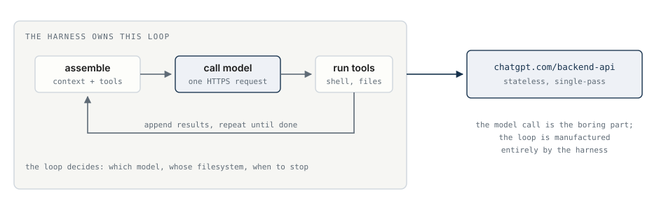
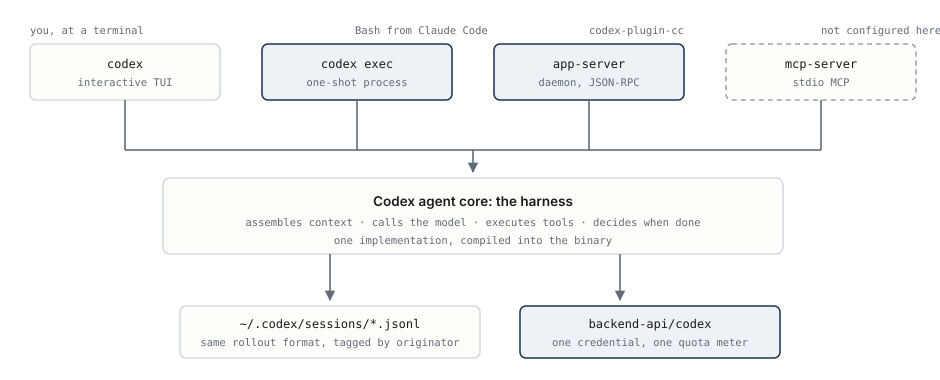
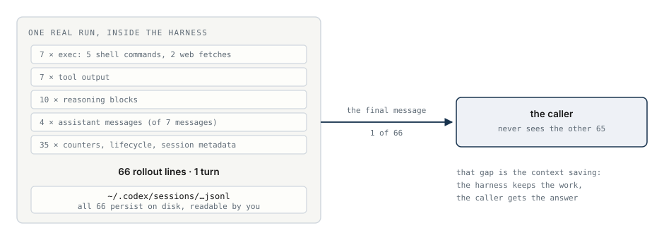
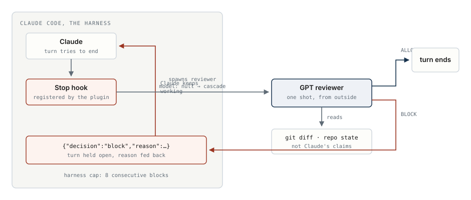
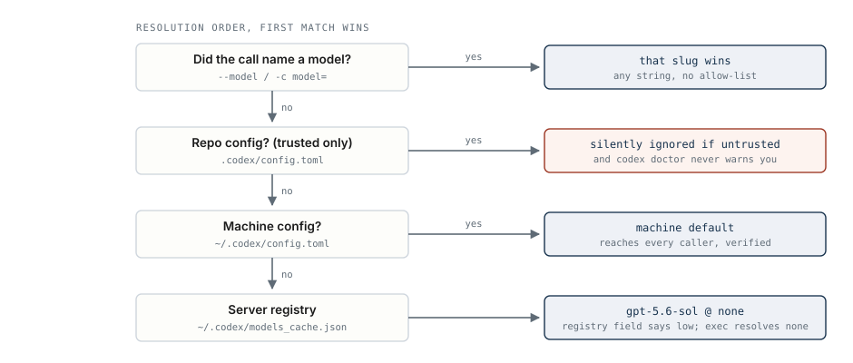
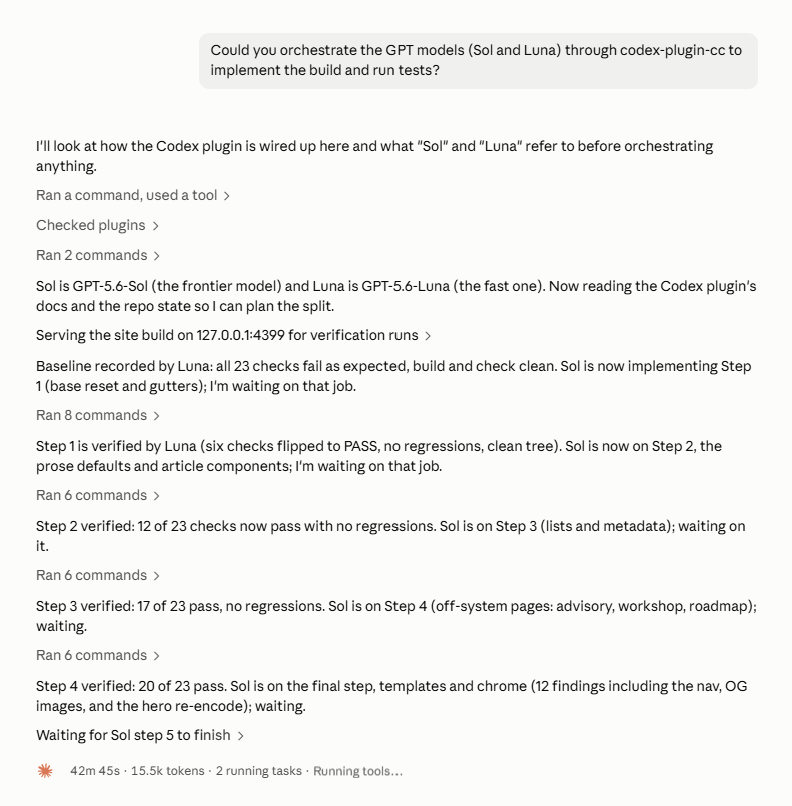
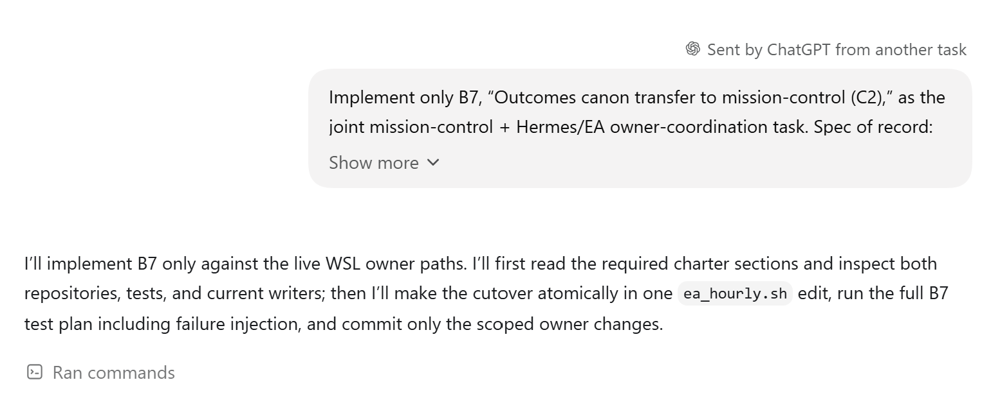

Last Wednesday night I watched a database table refute me in real time. I had written that GPT-5.6 only spawns sub-agents at `ultra`, its most expensive reasoning tier. The claim came from a careful read of prompt dumps and registry metadata. Then I ran the same delegation prompt at `low`, the cheapest tier. Codex's state database went from 0 spawn edges to 3. I repeated it on a model one generation down. Three more edges.

The claim was dead in 40 seconds. It had survived two days of reading.

That was the shape of my whole week. I wired GPT models into Claude Code four different ways, wrote a reference document with 124 tagged claims, and then audited it with live runs. The audit killed things reading could never kill. What survived is this article: the architecture, the new plugin OpenAI shipped for Claude Code, and the receipts.

## The Only Question That Matters

Every route from Claude Code to a GPT model ends at the same place: one HTTPS endpoint, one OAuth credential, one quota meter. The model call itself is stateless and single-pass. So what actually differs between the routes?

**The harness.** A harness is the component that assembles context, calls the model, executes the tool calls, appends results, and decides when the task is done. The loop does not exist on the server. It is manufactured entirely by whichever program owns it.


<p class="caption" style="text-align: center; margin-top: -8px; margin-bottom: 24px;">The model call is the boring part. The loop around it decides which model runs, whose filesystem the tools touch, and when to stop.</p>

Hold the loop and you hold everything: model choice, tool access, trust boundaries, the bill. Give the loop away and you get one thing back in exchange. More on that trade later.

## One Engine, Several Doors

The Codex CLI looks like a grab bag of subcommands. It is not. There is **one agent core**, compiled into a single binary. Around it sit several front doors: an interactive TUI, a one-shot `codex exec` process, a long-lived app-server daemon, and a stdio MCP server.


<p class="caption" style="text-align: center; margin-top: -8px; margin-bottom: 24px;">Every door runs the same compiled core, writes the same session format, and calls the same endpoint. The core tags each session with the door that opened it.</p>

This matters because `codex exec` from Claude Code's Bash tool is not a completion API. It is a **full agent delegating to a full agent**. I pulled one real run off my disk to show what that means:


<p class="caption" style="text-align: center; margin-top: -8px; margin-bottom: 24px;">A real run from my machine: 5 shell commands, 2 web fetches, 10 reasoning blocks. One line crossed back to the caller.</p>

Inside that single call, GPT ran 5 shell commands and 2 web fetches, produced 10 reasoning blocks, and wrote 66 lines to a JSONL file. Exactly 1 line returned to the caller. **The other 65 never touch your context window.** That gap is the entire economics of delegation. The sub-agent's work stays on disk, readable but never billed to the conversation that asked for it.

## The New Plugin

In July, OpenAI shipped [codex-plugin-cc](https://github.com/openai/codex-plugin-cc), an official Claude Code plugin. If `codex exec` already runs the full agent, what does a plugin add?

Not model capability. I verified that the hard way. The plugin drives the app-server daemon instead of spawning one-shot processes. Everything it adds is a *Claude Code* construct: slash commands, background job handles, and a thin Sonnet subagent that forwards work without reading your repo. Plus one thing nothing else can do.

A note on transparency, since I audited both: the plugin ships as readable source, and I verified my installed copy byte-identical to a pinned commit. The CLI ships as a 258 MB compiled binary that reports its own commit as `unknown`. Its supply chain is still verifiable, just indirectly. The npm package carries a [SLSA attestation](https://slsa.dev) naming the exact build commit, and the release publishes Sigstore bundles. I hashed my local binary against the signed digest:

```
signed sha256 : 73dc5888888f411c1f0fa7b81d866e721dcc86b527ce8e3b2cf4708661e823ba
local  sha256 : 73dc5888888f411c1f0fa7b81d866e721dcc86b527ce8e3b2cf4708661e823ba
```

A match. The binary on my machine is provably the one OpenAI's CI built from [openai/codex](https://github.com/openai/codex).

## The Gate That Refuses to Let a Turn End

Here is the one thing. Claude Code has a [Stop hook](https://code.claude.com/docs/en/hooks-guide): a lifecycle event that fires when Claude's turn is about to end, with the power to refuse. The plugin registers one. When the gate is on, the turn does not end until a GPT reviewer says it may.


<p class="caption" style="text-align: center; margin-top: -8px; margin-bottom: 24px;">On BLOCK, the harness holds the turn open and feeds the reason back to Claude, which keeps working. The cap is 8 consecutive blocks.</p>

I tested it with a deliberately broken `median()` function. The reviewer read the diff and returned:

```json
{"decision":"block","reason":"Codex stop-time review found issues that still
need fixes before ending the session: `median()` is incorrect for common inputs."}
```

Claude Code's documented behavior on that payload: hold the turn open, inject the reason, let Claude keep working. Enforcement, not advice.

Read the control flow carefully, because it answers the question everyone asks: does this let GPT control Claude, or Claude control GPT? **Neither.** The harness withholds turn completion from *its own* model. The GPT referee's entire authority is one line of text, and it reads the repository state rather than trusting what Claude said it did. The prompt is explicit: *"Do not treat the previous Claude response as proof that code changes happened; verify that from the repository state before you block."*

A regular review is advisory; the model can note issues and stop anyway. The gate is CI on a pull request, scaled down to a single turn. And `codex exec` cannot replicate it, ever: a Bash child process has no way to register a hook in Claude Code's lifecycle.

Two sharp edges before you enable it. The hook skips Claude Code's re-entry guard, so a stubborn reviewer can burn 8 full reviews in one turn. And a reviewer that crashes or times out also blocks. Enforcement cuts both ways.

## What Else the Receipts Killed

The audit refuted more of my document than I expected. Four more findings, each settled by execution:

**Any model name goes through, everywhere.** The review commands do not document a `--model` flag, but the code forwards one with no allow-list. I proved it end to end by passing a fake model and reading the server's rejection:

```
The 'ZZZ_NOT_A_MODEL' model is not supported when using Codex with a ChatGPT account.
```

The error names my string. The caller's model reached the API on a path the docs call locked.

**Repo-level config is silently ignored in untrusted repos.** I pinned a model in a scratch repo's `.codex/config.toml` and the pin did nothing. The binary honors project config only in a *trusted* repository, and `codex doctor` never mentions the file it ignored.


<p class="caption" style="text-align: center; margin-top: -8px; margin-bottom: 24px;">Four rungs, first match wins. The trust requirement on rung 2 is real and undocumented; I found it in the binary's error strings.</p>

**The defaults are stranger than the docs.** With nothing configured, the registry's top model wins (gpt-5.6-sol today). But the registry says its default effort is `low`, and the CLI actually resolves `none`. Two different answers to "what runs when I configure nothing," from the same vendor's own metadata.

**The effort ceiling is the real cap.** The plugin's validator refuses anything above `xhigh`. The raw CLI takes `max` and `ultra`. Model choice was never the constraint; reasoning effort is.

## How the Two Doors Compare

| | `codex exec` via Bash | codex-plugin-cc |
|---|---|---|
| The agent | identical: same binary, same core, same credential | identical |
| Model choice | any slug | any slug, verified live |
| Effort ceiling | `max`, `ultra` | `xhigh` |
| Schema-enforced output | `--output-schema` | adversarial review path only |
| Process model | fresh per call | shared daemon, no cold start |
| Background jobs | hand-rolled | built in |
| Stop-time review gate | impossible | **yes** |

On raw capability, `codex exec` wins. It reaches reasoning tiers the plugin refuses to send. Everything the plugin uniquely adds lives on the Claude Code side of the boundary. The gate is the only entry in that table nothing else provides.

So "which is better" has no answer, and that is a finding, not a dodge. The two doors have disjoint exclusive capabilities and share everything else. The only wrong choice is picking one and pretending the other does not exist.

## My Setup Now

Three moves, in the order I would redo them:

1. **Install the plugin as the resident integration.** `/plugin marketplace add openai/codex-plugin-cc`, then `/plugin install codex@openai-codex`. Reviews, background delegation, and the gate live here.
2. **Decide your model pin deliberately.** A one-line `~/.codex/config.toml` is the only lever that reaches every caller, including the gate. I left mine unpinned (the server default suits me) but I know exactly which file changes it.
3. **Keep `codex exec` as the escape hatch.** When a job needs `max` or `ultra` reasoning, or schema-enforced output, drop to Bash. Same credential, same engine, zero setup.

The gate stays off by default, per repo, and that is the right default. Turn it on where a wrong diff actually costs you something.

Here is what that split looks like on a real job. I asked Claude Code to orchestrate Sol and Luna through the plugin to implement a build and run its tests. Claude planned the split itself: Sol implements, Luna verifies each step against 23 checks.


<p class="caption" style="text-align: center; margin-top: -8px; margin-bottom: 24px;">Claude Code as orchestrator. Luna records the baseline, Sol implements step by step, Luna verifies: 6, 12, 17, then 20 of 23 checks passing with no regressions. The session footer reads 42m 45s and 15.5k tokens.</p>

**Every command Sol ran stayed out of that 15.5k.** On the Codex side, each step arrives as a scoped task. This one reads the spec, makes the cutover in a single file edit, runs the test plan with failure injection, and commits only the scoped changes.


<p class="caption" style="text-align: center; margin-top: -8px; margin-bottom: 24px;">Codex for implementation and verification. The task arrives from Claude Code; the harness that runs it keeps the work on its own side of the boundary.</p>

Next step for me: this site's repo gets the gate. The referee that blocked my broken `median()` can review the commit that publishes this post. A week of making claims meet their receipts taught me to trust exactly one kind of documentation: the kind with command output in it.
