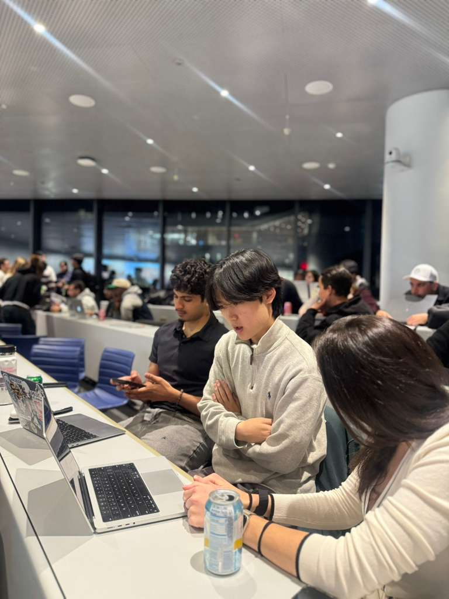
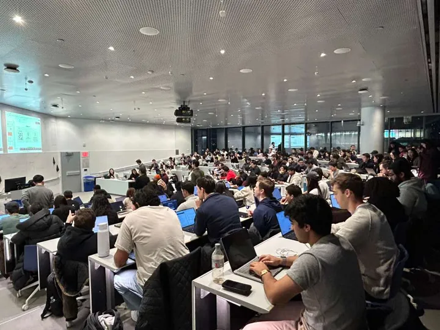
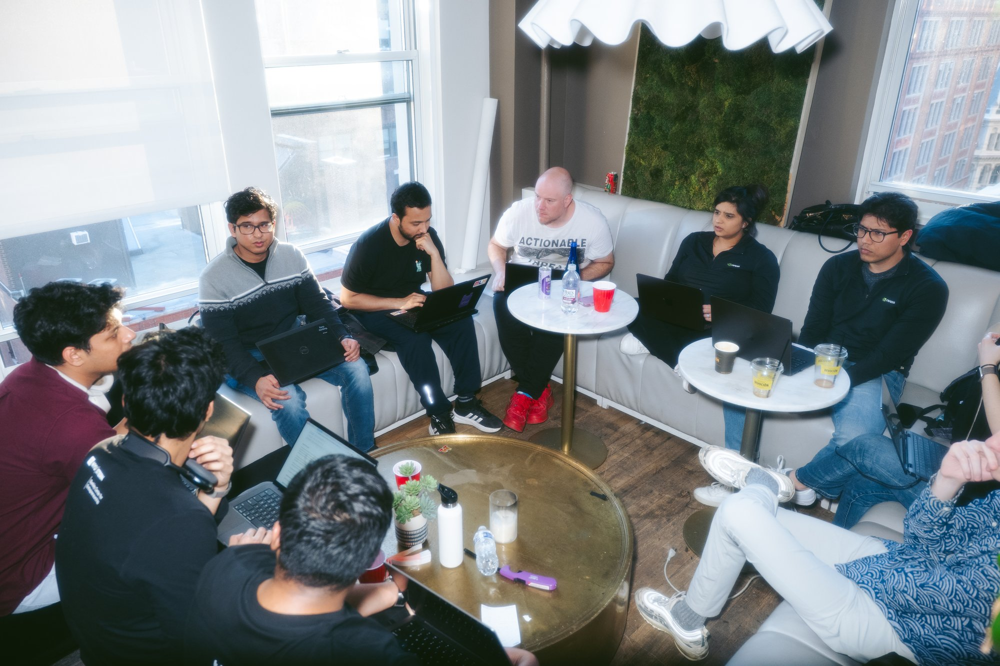
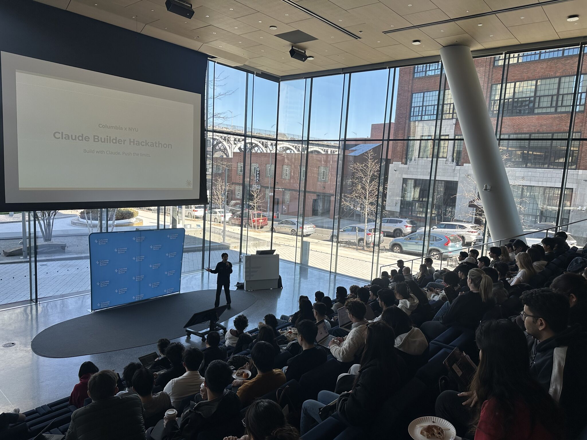
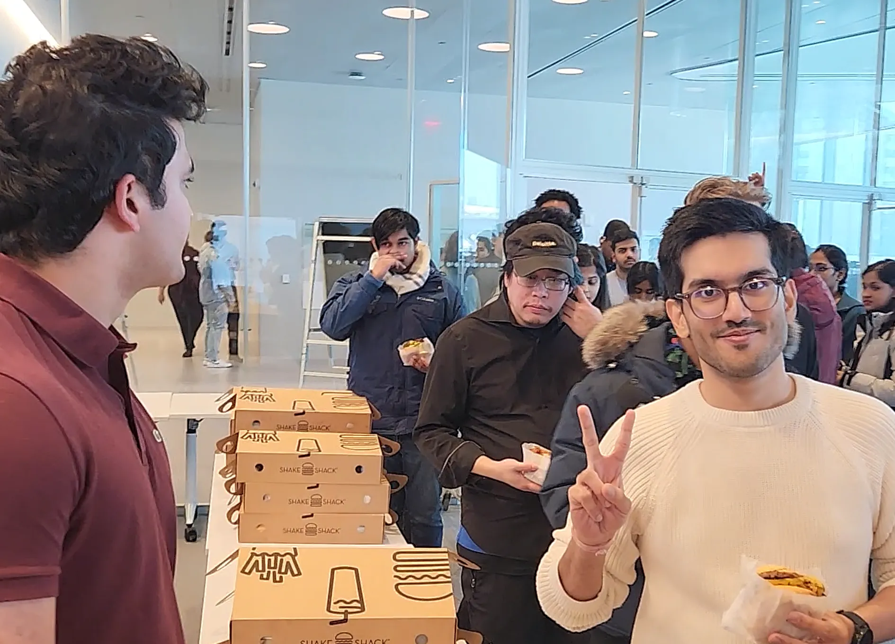

It was past midnight in downtown Manhattan when a team waved me over to show me their demo. I watched it run. Demo looks great. *Hmm, looks great.* And then I asked the question I ask most: *"What user problem does this solve? Does this add value to how users currently get the job done?"*

They looked at each other, started to answer, but soon stopped. *"We'll come back."* The next morning they came back with a sharp vision of the problem, not more features. The demo had not changed, but **the team had.**

Can a single question transform a team overnight? It does happen and I've seen it multiple times.

That moment is the whole job, and it barely involves hackathons. It happens in office hours, in a workshop full of product managers, in the replies to my LinkedIn posts. I have had an unusually good seat for it: I joined the first global cohort of Anthropic's Claude Ambassadors last year, when Claude Code was still a developer-only tool and most students on campus had not heard of Anthropic. Since then I have run 70+ sessions for audiences that spanned the whole range, from undergrads writing their first `CLAUDE.md` to CTOs shipping to production.

A community is what makes that moment keep happening after everyone goes home. Strip away the events and it comes down to three things: a door people can walk through, a way they get better once they are inside, and the rails and relationships that keep it alive when you leave. Here is why I love building each one and how I do it.

## At the door

**I love being the front door.** On Valentine's Day I packed a [Columbia board room](/writings/iterate-columbia-hackathon-2026-recap/) with 300 strangers across NYC who came to build for 12 hours: 60+ teams, 8 sponsors. Most campus hackathons draw from a single school; we opened ours to business and engineering students, founders, and first-time builders in the same room.

Kick-off keynote for 300 builders on Valentine’s morning. The moment I open the door always gets me ‘nervocited’.

But the door is not only a hackathon. It is a room of [Directors and C-suite leaders](/writings/what-senior-business-leaders-ask-about-ai/) asking their first honest questions about the technology. It is a [workshop that turns product managers into people who build with AI instead of around it](/writings/ai-superpower-for-pm/). It is a session for people who think they showed up to AI too late. Belonging is not an abstraction to me: I came to New York as an international student, and I know what it is to stand in a room unsure you are allowed to be in it. Every time, the job is the same: move someone from *AI is happening to me* to *I can build with this*, and put them where they belong.

A workshop turning product managers into people who build with AI, not around it.

## Inside the room

Getting people through the door is the start. Once they are in the room, they have to get better, and that is a multiplier I can work on directly. At [Mistral's worldwide hackathon](/writings/mistral-worldwide-hackathon-2026-recap/) I judged and mentored across a 36-hour sprint that ran in 7 cities at once. The questions I pushed on moved more teams than any code I could have written for them: the problem, and the responsibility (*"How do you ensure safety, privacy, public good, and inclusion?"*). The teams that paused and came back sharper won; the ones that only stacked on technical sophistication did not.

Mentors, judges and builders huddled over various technical and analytical challenges.

I always took the question about responsibility and safety seriously. But I never believed these ideas could actually get me excited. Not until one event.

At the Claude Builder Hackathon I ran this spring, a team called 'Pulse' came together from a mix of Columbia and NYU students. Four first-time hackers looked at overlapping pharmacy closures and fentanyl overdose deaths in the Bronx, found that pharmacy job postings dry up 3-6 months before a closure, and built a forecasting model that dispatches mobile naloxone units before the gap opens. That is what a room gives you when you pose the challenge around real problems (*'Can you identify a problem that hurts this City?'*) and hold it to a real standard (*'Can capabilities of AI be responsibly put into solving the problem for humanity?'*).

The first cross-school Claude Builder Hackathon, a joint Columbia and NYU event

Mentoring one team at a time does not scale, so I also teach in public. I write deep-dives that reach past any single room, on [why agents need better infrastructure than better models](/writings/agents-need-better-infrastructure/), [what memory should look like for a coding agent](/writings/files-are-the-memory/), and [what held across 13 months of Claude Code's source](/writings/tracing-the-minds-behind-claude-code/), and I build the tools I wish builders had, like [claude-ensemble](https://github.com/tyoon10/claude-ensemble). A question, an essay, or a tool: each one keeps working in someone else's hands after I am gone.

## After the close

A great weekend is not a lasting community. What you build after the close is. The 300-person event ran on a **20-person team where every person owned a lane:** sponsor onboarding and API-key distribution, registration, judging, catering windows. Clarity of ownership was the actual product.

Lunch for 300 builders. Delivering a day like this takes a whole team, and that shared effort is what brings a community together.

The higher-leverage work is between events, and between organizers. That Claude Builder Hackathon, a joint Columbia and NYU event, worked only because a group of us built it together. I grew the NYC builder community from 0 to 1,300+ developers, led Columbia's largest AI club and its startup challenge, and founded BRAIN NYC. All of it taught me the same thing: the leverage is not running one more event myself. It is developing the other organizers: connecting campus leads so they trade what works, and handing the next one the sponsor flow, the judging rubric, and the run-of-show instead of letting them rediscover it. Some of that scaffolding is literally code. I build and ship tooling on GitHub, and before any of this I co-founded CONCAT (AI-enabled FinTech that got acquired), where I built the ML pipeline behind our core recommendation engine. I build under real deadlines, not only organize rooms where other people build.

## Why I cannot picture anything else

**Communities that last are built, not gathered.** Coming from a technical startup founder background, the foundational concepts came surprisingly naturally to me. I led the building of an AI pipeline behind the company, and closed a deal to unlock value for millions of customers. So I mentor from having shipped real products under real constraints. I work as a product manager, so I turn what a community needs into something people actually use and engage with. And of course, I measure whether it worked. Lastly, I apply the 'boring' lens: when the pressure grows to defer human judgment to the model, I hold the line on safety, privacy, and the values a community exists to protect.

Community building is the only work I have found that needs all of it at once, and the only one whose returns compound in people. I think there's a beautiful multiplier effect in this iterative process. This is the one I keep coming back to, because it uses everything and gives back more than I put in. When I picture the next ten years, I cannot picture doing anything else.
