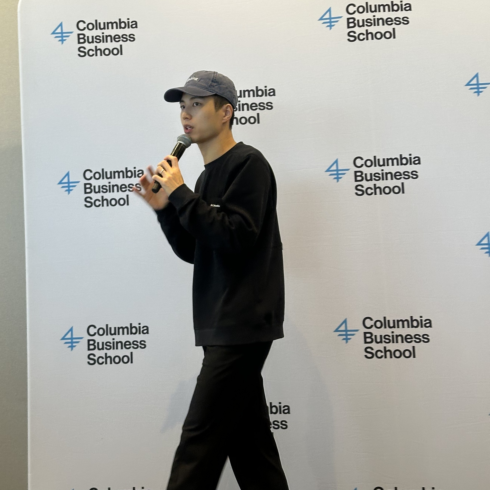

It was past midnight at a hackathon in Manhattan when a team waved me over to show me their demo. Clean interface, fast inference, a model running on hardware in the room. I watched it run and asked the question I ask most: *"What user problem does this solve? Does this add value to how users currently get the job done?"*

They went quiet, started to answer, stopped. Twenty minutes later they came back with a sharper version of the problem, not more features. The demo had not changed. The team had.

That moment is the whole job, and it barely involves hackathons. It happens in office hours, in a workshop full of product managers, in the replies to something I wrote, in a hallway after a lecture. The hackathon is only where it is easiest to see. A community is what makes that moment keep happening after everyone goes home. Strip away the events and it comes down to three things: a door people can walk through, a way they get better once they are inside, and the rails and relationships that keep it alive when you leave. Here are the three reasons I love building each one.

## Reason 1: A door people can walk through

I love being the front door. On Valentine's Day I helped pack a [Columbia board room](/writings/iterate-columbia-hackathon-2026-recap/) with nearly 300 strangers who came to build for twelve hours: 60+ teams, 8 sponsors, one deliberate rule. Most campus hackathons draw from a single school; we opened ours to business and engineering students, founders, and first-time builders in the same room.

Registration lines as the doors opened on Valentine's Day; full recap <a href="https://twyoon.com/writings/iterate-columbia-hackathon-2026-recap">here</a>.

But the door is not only a hackathon. It is a club kickoff for people who think they showed up to AI too late. It is a room of [Directors and C-suite leaders](/writings/what-senior-business-leaders-ask-about-ai/) asking their first honest questions about the technology. It is a [workshop that turns product managers into people who build with AI instead of around it](/writings/ai-superpower-for-pm/). Every time, the job is the same: move someone from *AI is happening to me* to *I can build with this*, and put them where they belong. Watching that shift is the part I never tire of.

## Reason 2: A way they get better once inside

Getting people in is the start; then they have to get better, and that is a multiplier I can work on directly. At Mistral's [worldwide hackathon](/writings/mistral-worldwide-hackathon-2026-recap/) I judged and mentored across a 36-hour sprint that ran in seven cities at once. The questions I pushed on moved more teams than any code I could have written for them: the problem (*"What user problem does this solve?"*) and the responsibility (*"How do you ensure safety, for privacy, public good, and inclusion?"*). The teams that paused and came back sharper won; the ones that only stacked on technical sophistication did not.

A mentoring circle, judges and builders huddled over a project; full recap <a href="https://twyoon.com/writings/mistral-worldwide-hackathon-2026-recap">here</a>.

Mentoring one team at a time does not scale, so I also teach in public. I write deep-dives that reach past any single room: [why agents need better infrastructure more than better models](/writings/agents-need-better-infrastructure/), [what memory should look like for a coding agent](/writings/files-are-the-memory/), and [what held and changed across thirteen months of Claude Code's source](/writings/tracing-the-minds-behind-claude-code/). And I build the tools I wish builders had, like [claude-ensemble](https://github.com/tyoon10/claude-ensemble), an Opus panel-and-judge kit I validated with blind, length-controlled A/B evals. A question, an essay, or a tool: each one keeps working in someone else's hands after I am gone. Leverage you can measure in other people's output is the most satisfying kind I know.

## Reason 3: The rails and relationships that outlast the room

A great weekend is not a lasting community. The [300-person event](/writings/iterate-columbia-hackathon-2026-recap/) ran on a 20-person team where every person owned a lane: sponsor onboarding and API-key distribution, registration, judging, catering windows. Clarity of ownership was the actual product.

The operating crew that kept the day running; full recap <a href="https://twyoon.com/writings/iterate-columbia-hackathon-2026-recap">here</a>.

The higher-leverage work is between events, and between organizers. Building Claude's NYC builder ecosystem from zero to over 1,300 developers, leading a business-school AI club and its startup challenge, and founding BRAIN NYC taught me that the leverage is not running one more event myself. It is developing the other organizers: connecting campus leads so they trade what works, and handing the next one the sponsor flow, the judging rubric, and the run-of-show instead of letting them rediscover it. Some of that scaffolding is literally code. I build and ship tooling on GitHub, and before any of this I co-founded Concat, an insurtech acquired by a major insurer, where I led the ML behind a recommendation engine that aggregated coverage data through authenticated insurer APIs and ranked policies against an expert rubric. I build under real deadlines, not only organize rooms where other people build. The output of this layer is other people's growth, and it keeps compounding after I leave.

## Why I cannot picture anything else

On paper my path looks scattered: a CFA charter, a company I co-founded and sold, machine-learning research, product roles, [a strategy engagement with a newsroom](/projects/access-to-experts/), [quant-finance AI research](/projects/ai-pipeline-quant-finance/), and a lot of essays. From here it is plainly one thing. Each of those was a way to get closer to the same seam, the one where the frontier reaches the people who will build on it.

Community building is the only work I have found that needs all of it at once: the technical depth to earn builders' trust, the product sense to know what to build, the operations to make it run, the writing to teach at scale, and the relationships to make it last. It is also the only work whose returns compound in people instead of in me. **Communities that last are built, not gathered.** I have tried the narrower paths; this is the one I keep coming back to, because it uses everything and gives back more than I put in. When I picture the next ten years, I cannot picture doing anything else.
